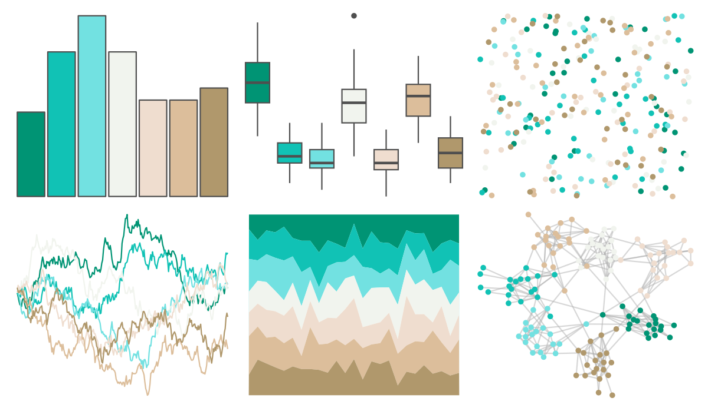

# PNWColors - Anemone 

::: columns
::: {.column width="50%"}

**Github**

[jakelawlor/PNWColors](https://github.com/jakelawlor/PNWColors)
:::

::: {.column width="50%"}

**CRAN**

Not on CRAN
:::
:::

<hr> 

Use with [paletteer](https://emilhvitfeldt.github.io/paletteer/) package:

```r
library(paletteer)
paletteer_d("PNWColors::Anemone")
```

Use raw:

```r
c("#009474FF", "#11C2B5FF", "#72E1E1FF", "#F1F4EEFF", "#EFDDCFFF", "#DCBE9BFF", "#B0986CFF")
``` 

 

<br>

# Related Palettes

<div class="list" style="display: grid; grid-template-columns: auto auto auto;"> <figure class="figure">
<a href="../../amerika/Dem_Ind_Rep3/"> </a>
</figure> <figure class="figure">
<a href="../../wesanderson/Moonrise3/"> </a>
</figure> <figure class="figure">
<a href="../../nationalparkcolors/Yellowstone/"> </a>
</figure> <figure class="figure">
<a href="../../fishualize/Lycengraulis_grossidens/"> </a>
</figure> <figure class="figure">
<a href="../../nbapalettes/spurs/"> </a>
</figure> <figure class="figure">
<a href="../../wesanderson/Royal2/"> </a>
</figure> <figure class="figure">
<a href="../../nationalparkcolors/MtRainier/"> </a>
</figure> <figure class="figure">
<a href="../../wesanderson/Chevalier1/"> </a>
</figure> <figure class="figure">
<a href="../../trekcolors/ferengi/"> </a>
</figure> <figure class="figure">
<a href="../../beyonce/X54/"> </a>
</figure> <figure class="figure">
<a href="../../waRhol/camo_87_5/"> </a>
</figure> <figure class="figure">
<a href="../../ButterflyColors/anteos_clorinde/"> </a>
</figure> 
</div>
