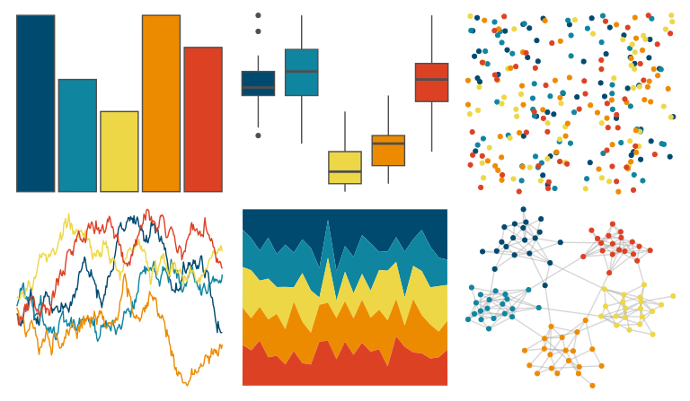

# PNWColors - Bay 

::: columns
::: {.column width="50%"}

**Github**

[jakelawlor/PNWColors](https://github.com/jakelawlor/PNWColors)
:::

::: {.column width="50%"}

**CRAN**

Not on CRAN
:::
:::

<hr> 

Use with [paletteer](https://emilhvitfeldt.github.io/paletteer/) package:

```r
library(paletteer)
paletteer_d("PNWColors::Bay")
```

Use raw:

```r
c("#00496FFF", "#0F85A0FF", "#EDD746FF", "#ED8B00FF", "#DD4124FF")
``` 

 

<br>

# Related Palettes

<div class="list" style="display: grid; grid-template-columns: auto auto auto;"> <figure class="figure">
<a href="../../awtools/a_palette/"> </a>
</figure> <figure class="figure">
<a href="../../soilpalettes/redox2/"> </a>
</figure> <figure class="figure">
<a href="../../MetBrewer/Johnson/"> </a>
</figure> <figure class="figure">
<a href="../../LaCroixColoR/PeachPear/"> </a>
</figure> <figure class="figure">
<a href="../../suffrager/london/"> </a>
</figure> <figure class="figure">
<a href="../../lisa/PaulGauguin/"> </a>
</figure> <figure class="figure">
<a href="../../calecopal/kelp1/"> </a>
</figure> <figure class="figure">
<a href="../../yarrr/espresso/"> </a>
</figure> <figure class="figure">
<a href="../../MetBrewer/Navajo/"> </a>
</figure> <figure class="figure">
<a href="../../MetBrewer/Egypt/"> </a>
</figure> <figure class="figure">
<a href="../../suffrager/CarolMan/"> </a>
</figure> <figure class="figure">
<a href="../../LaCroixColoR/Orange/"> </a>
</figure> 
</div>
