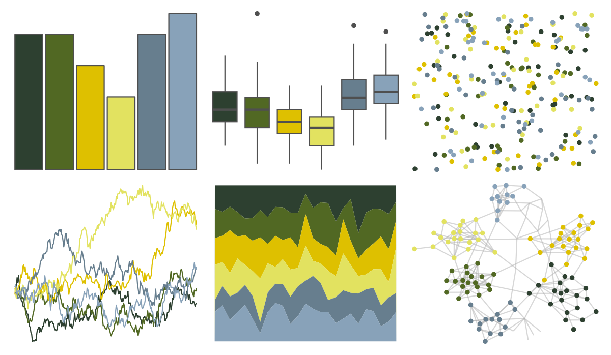

# PNWColors - Cascades 

::: columns
::: {.column width="50%"}

**Github**

[jakelawlor/PNWColors](https://github.com/jakelawlor/PNWColors)
:::

::: {.column width="50%"}

**CRAN**

Not on CRAN
:::
:::

<hr> 

Use with [paletteer](https://emilhvitfeldt.github.io/paletteer/) package:

```r
library(paletteer)
paletteer_d("PNWColors::Cascades")
```

Use raw:

```r
c("#2D4030FF", "#516823FF", "#DEC000FF", "#E2E260FF", "#677E8EFF", "#88A2B9FF")
``` 

 

<br>

# Related Palettes

<div class="list" style="display: grid; grid-template-columns: auto auto auto;"> <figure class="figure">
<a href="../../amerika/Dem_Ind_Rep3/"> </a>
</figure> <figure class="figure">
<a href="../../calecopal/sierra2/"> </a>
</figure> <figure class="figure">
<a href="../../poisonfrogs/Rispotted/"> </a>
</figure> <figure class="figure">
<a href="../../lisa/WassilyKandinsky/"> </a>
</figure> <figure class="figure">
<a href="../../colRoz/r_aculeatus/"> </a>
</figure> <figure class="figure">
<a href="../../lisa/VincentvanGogh_1/"> </a>
</figure> <figure class="figure">
<a href="../../fishualize/Valenciennea_strigata/"> </a>
</figure> <figure class="figure">
<a href="../../MoMAColors/Dali/"> </a>
</figure> <figure class="figure">
<a href="../../beyonce/X22/"> </a>
</figure> <figure class="figure">
<a href="../../peRReo/rosalia/"> </a>
</figure> <figure class="figure">
<a href="../../calecopal/bigsur2/"> </a>
</figure> <figure class="figure">
<a href="../../ggprism/starry2/"> </a>
</figure> 
</div>
