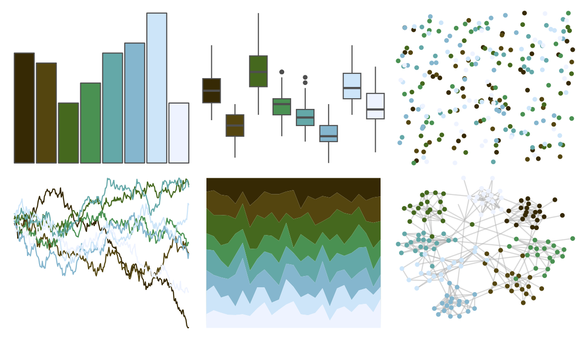
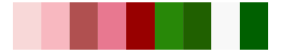

# PNWColors - Lake 

::: columns
::: {.column width="50%"}

**Github**

[jakelawlor/PNWColors](https://github.com/jakelawlor/PNWColors)
:::

::: {.column width="50%"}

**CRAN**

Not on CRAN
:::
:::

<hr> 

Use with [paletteer](https://emilhvitfeldt.github.io/paletteer/) package:

```r
library(paletteer)
paletteer_d("PNWColors::Lake")
```

Use raw:

```r
c("#362904FF", "#54450FFF", "#45681EFF", "#4A9152FF", "#64A8A8FF", "#85B6CEFF", "#CDE5F9FF", "#EEF3FFFF")
``` 

 

<br>

# Related Palettes

<div class="list" style="display: grid; grid-template-columns: auto auto auto;"> <figure class="figure">
<a href="../../awtools/a_palette/"> </a>
</figure> <figure class="figure">
<a href="../../tayloRswift/taylorSwift/"> </a>
</figure> <figure class="figure">
<a href="../../RColorBrewer/PuBuGn/"> </a>
</figure> <figure class="figure">
<a href="../../RColorBrewer/BuGn/"> </a>
</figure> <figure class="figure">
<a href="../../yarrr/ohbrother/"> </a>
</figure> <figure class="figure">
<a href="../../ggsci/teal_material/"> </a>
</figure> <figure class="figure">
<a href="../../nbapalettes/bucks_earned/"> </a>
</figure> <figure class="figure">
<a href="../../fishualize/Thalassoma_hardwicke/"> </a>
</figure> <figure class="figure">
<a href="../../RColorBrewer/BrBG/"> </a>
</figure> <figure class="figure">
<a href="../../RColorBrewer/GnBu/"> </a>
</figure> <figure class="figure">
<a href="../../palettetown/igglybuff/"> </a>
</figure> <figure class="figure">
<a href="../../Redmonder/sPBIGn/"> </a>
</figure> 
</div>
