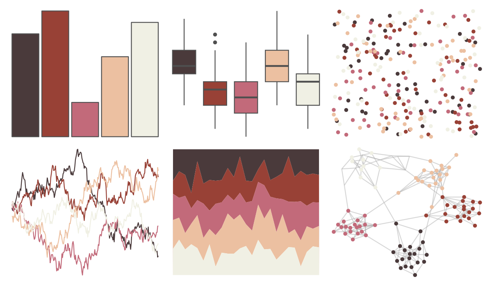

# PNWColors - Moth 

::: columns
::: {.column width="50%"}

**Github**

[jakelawlor/PNWColors](https://github.com/jakelawlor/PNWColors)
:::

::: {.column width="50%"}

**CRAN**

Not on CRAN
:::
:::

<hr> 

Use with [paletteer](https://emilhvitfeldt.github.io/paletteer/) package:

```r
library(paletteer)
paletteer_d("PNWColors::Moth")
```

Use raw:

```r
c("#4A3A3BFF", "#984136FF", "#C26A7AFF", "#ECC0A1FF", "#F0F0E4FF")
``` 

 

<br>

# Related Palettes

<div class="list" style="display: grid; grid-template-columns: auto auto auto;"> <figure class="figure">
<a href="../../amerika/Dem_Ind_Rep3/"> </a>
</figure> <figure class="figure">
<a href="../../tayloRswift/midnightsBloodMoon/"> </a>
</figure> <figure class="figure">
<a href="../../fishualize/Epinephelus_fasciatus/"> </a>
</figure> <figure class="figure">
<a href="../../rcartocolor/BrwnYl/"> </a>
</figure> <figure class="figure">
<a href="../../tayloRswift/taylor1989/"> </a>
</figure> <figure class="figure">
<a href="../../colRoz/e_kingii/"> </a>
</figure> <figure class="figure">
<a href="../../rockthemes/harvey/"> </a>
</figure> <figure class="figure">
<a href="../../soilpalettes/alaquod/"> </a>
</figure> <figure class="figure">
<a href="../../ochRe/galah/"> </a>
</figure> <figure class="figure">
<a href="../../fishualize/Sander_lucioperca/"> </a>
</figure> <figure class="figure">
<a href="../../fishualize/Lutjanus_sebae/"> </a>
</figure> <figure class="figure">
<a href="../../rockthemes/peacesells/"> </a>
</figure> 
</div>
