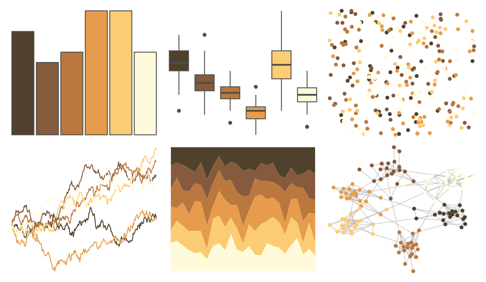

# PNWColors - Mushroom 

::: columns
::: {.column width="50%"}

**Github**

[jakelawlor/PNWColors](https://github.com/jakelawlor/PNWColors)
:::

::: {.column width="50%"}

**CRAN**

Not on CRAN
:::
:::

<hr> 

Use with [paletteer](https://emilhvitfeldt.github.io/paletteer/) package:

```r
library(paletteer)
paletteer_d("PNWColors::Mushroom")
```

Use raw:

```r
c("#4F412BFF", "#865A3CFF", "#BA783EFF", "#E69C4CFF", "#FBCC74FF", "#FFFBDAFF")
``` 

 

<br>

# Related Palettes

<div class="list" style="display: grid; grid-template-columns: auto auto auto;"> <figure class="figure">
<a href="../../amerika/Dem_Ind_Rep3/"> </a>
</figure> <figure class="figure">
<a href="../../beyonce/X28/"> </a>
</figure> <figure class="figure">
<a href="../../poisonfrogs/Dsarayacuensis/"> </a>
</figure> <figure class="figure">
<a href="../../tayloRswift/fearless/"> </a>
</figure> <figure class="figure">
<a href="../../palettetown/ninetales/"> </a>
</figure> <figure class="figure">
<a href="../../rcartocolor/Fall/"> </a>
</figure> <figure class="figure">
<a href="../../IslamicArt/fes/"> </a>
</figure> <figure class="figure">
<a href="../../soilpalettes/bangor/"> </a>
</figure> <figure class="figure">
<a href="../../lisa/JohannJacobUlrich/"> </a>
</figure> <figure class="figure">
<a href="../../colRoz/v_acanthurus/"> </a>
</figure> <figure class="figure">
<a href="../../tayloRswift/fearlessTV/"> </a>
</figure> <figure class="figure">
<a href="../../blueycolors/chilli/"> </a>
</figure> 
</div>
