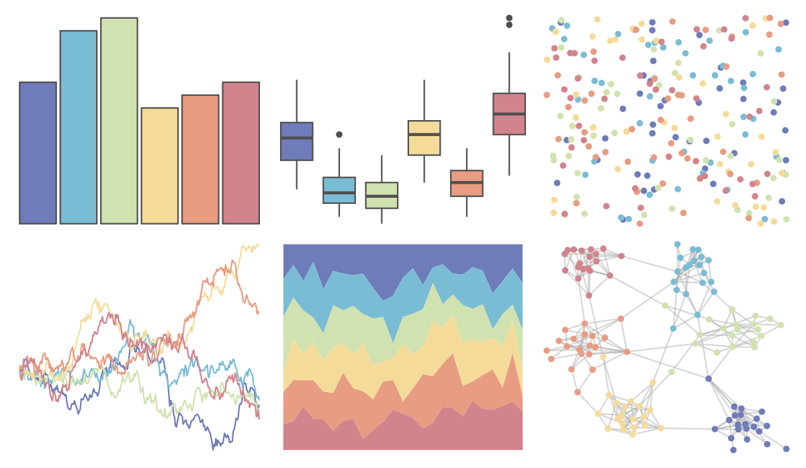

# PNWColors - Sailboat 

::: columns
::: {.column width="50%"}

**Github**

[jakelawlor/PNWColors](https://github.com/jakelawlor/PNWColors)
:::

::: {.column width="50%"}

**CRAN**

Not on CRAN
:::
:::

<hr> 

Use with [paletteer](https://emilhvitfeldt.github.io/paletteer/) package:

```r
library(paletteer)
paletteer_d("PNWColors::Sailboat")
```

Use raw:

```r
c("#6E7CB9FF", "#7BBCD5FF", "#D0E2AFFF", "#F5DB99FF", "#E89C81FF", "#D2848DFF")
``` 

 

<br>

# Related Palettes

<div class="list" style="display: grid; grid-template-columns: auto auto auto;"> <figure class="figure">
<a href="../../awtools/a_palette/"> </a>
</figure> <figure class="figure">
<a href="../../ggthemes/excel_Paper/"> </a>
</figure> <figure class="figure">
<a href="../../PNWColors/Shuksan2/"> </a>
</figure> <figure class="figure">
<a href="../../NineteenEightyR/sonny/"> </a>
</figure> <figure class="figure">
<a href="../../nord/aurora/"> </a>
</figure> <figure class="figure">
<a href="../../lisa/JackBush_1/"> </a>
</figure> <figure class="figure">
<a href="../../NineteenEightyR/miami2/"> </a>
</figure> <figure class="figure">
<a href="../../rcartocolor/Earth/"> </a>
</figure> <figure class="figure">
<a href="../../lisa/M_C_Escher/"> </a>
</figure> <figure class="figure">
<a href="../../fishualize/Halichoeres_bivittatus/"> </a>
</figure> <figure class="figure">
<a href="../../ggthemes/excel_Crop/"> </a>
</figure> <figure class="figure">
<a href="../../nationalparkcolors/ArcticGates/"> </a>
</figure> 
</div>
