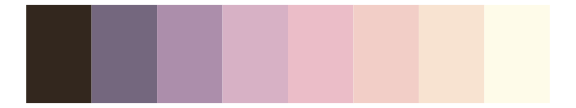

# PNWColors - Shuksan 

::: columns
::: {.column width="50%"}

**Github**

[jakelawlor/PNWColors](https://github.com/jakelawlor/PNWColors)
:::

::: {.column width="50%"}

**CRAN**

Not on CRAN
:::
:::

<hr> 

Use with [paletteer](https://emilhvitfeldt.github.io/paletteer/) package:

```r
library(paletteer)
paletteer_d("PNWColors::Shuksan")
```

Use raw:

```r
c("#33271EFF", "#74677EFF", "#AC8EABFF", "#D7B1C5FF", "#EBBDC8FF", "#F2CEC7FF", "#F8E3D1FF", "#FEFBE9FF")
``` 

 

<br>

# Related Palettes

<div class="list" style="display: grid; grid-template-columns: auto auto auto;"> <figure class="figure">
<a href="../../awtools/a_palette/"> </a>
</figure> <figure class="figure">
<a href="../../rcartocolor/TealRose/"> </a>
</figure> <figure class="figure">
<a href="../../beyonce/X56/"> </a>
</figure> <figure class="figure">
<a href="../../Redmonder/dPBIPuOr/"> </a>
</figure> <figure class="figure">
<a href="../../ggpomological/pomological_base/"> </a>
</figure> <figure class="figure">
<a href="../../calecopal/caqu/"> </a>
</figure> <figure class="figure">
<a href="../../vapoRwave/floralShoppe/"> </a>
</figure> <figure class="figure">
<a href="../../Redmonder/dPBIYlPu/"> </a>
</figure> <figure class="figure">
<a href="../../palettetown/heracross/"> </a>
</figure> <figure class="figure">
<a href="../../palettetown/venomoth/"> </a>
</figure> <figure class="figure">
<a href="../../palettetown/rhyhorn/"> </a>
</figure> <figure class="figure">
<a href="../../palettetown/mantine/"> </a>
</figure> 
</div>
