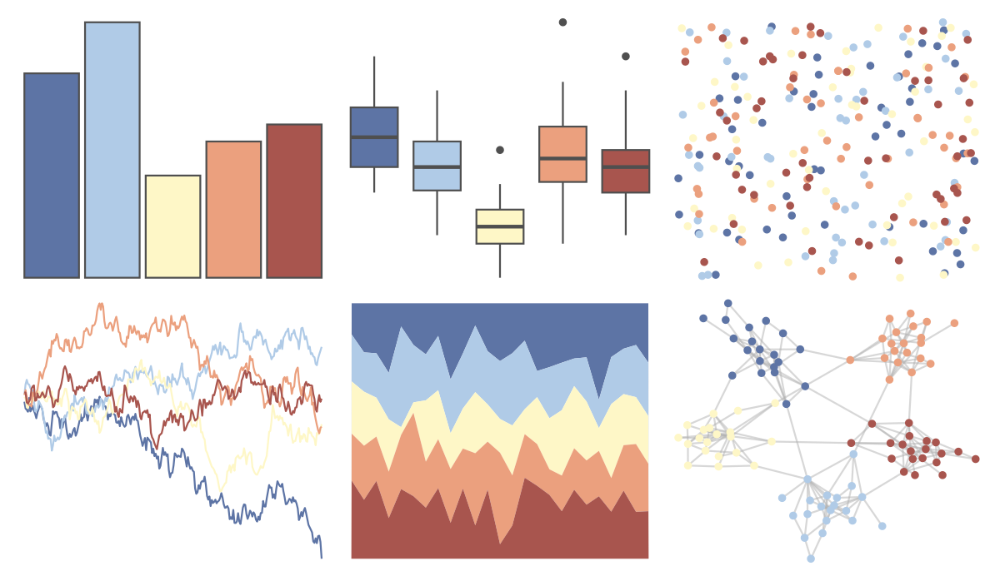
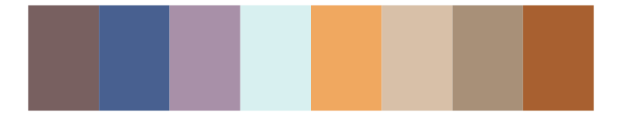

# PNWColors - Shuksan2 

::: columns
::: {.column width="50%"}

**Github**

[jakelawlor/PNWColors](https://github.com/jakelawlor/PNWColors)
:::

::: {.column width="50%"}

**CRAN**

Not on CRAN
:::
:::

<hr> 

Use with [paletteer](https://emilhvitfeldt.github.io/paletteer/) package:

```r
library(paletteer)
paletteer_d("PNWColors::Shuksan2")
```

Use raw:

```r
c("#5D74A5FF", "#B0CBE7FF", "#FEF7C7FF", "#EBA07EFF", "#A8554EFF")
``` 

 

<br>

# Related Palettes

<div class="list" style="display: grid; grid-template-columns: auto auto auto;"> <figure class="figure">
<a href="../../awtools/a_palette/"> </a>
</figure> <figure class="figure">
<a href="../../PNWColors/Sailboat/"> </a>
</figure> <figure class="figure">
<a href="../../rockthemes/californication/"> </a>
</figure> <figure class="figure">
<a href="../../colRoz/desert_sunset/"> </a>
</figure> <figure class="figure">
<a href="../../nationalparkcolors/ArcticGates/"> </a>
</figure> <figure class="figure">
<a href="../../fishualize/Rhinecanthus_assasi/"> </a>
</figure> <figure class="figure">
<a href="../../ochRe/namatjira_div/"> </a>
</figure> <figure class="figure">
<a href="../../nationalparkcolors/Redwoods/"> </a>
</figure> <figure class="figure">
<a href="../../fishualize/Xyrichthys_novacula/"> </a>
</figure> <figure class="figure">
<a href="../../nationalparkcolors/Badlands/"> </a>
</figure> <figure class="figure">
<a href="../../khroma/BuRd/"> </a>
</figure> <figure class="figure">
<a href="../../lisa/PabloPicasso_1/"> </a>
</figure> 
</div>
