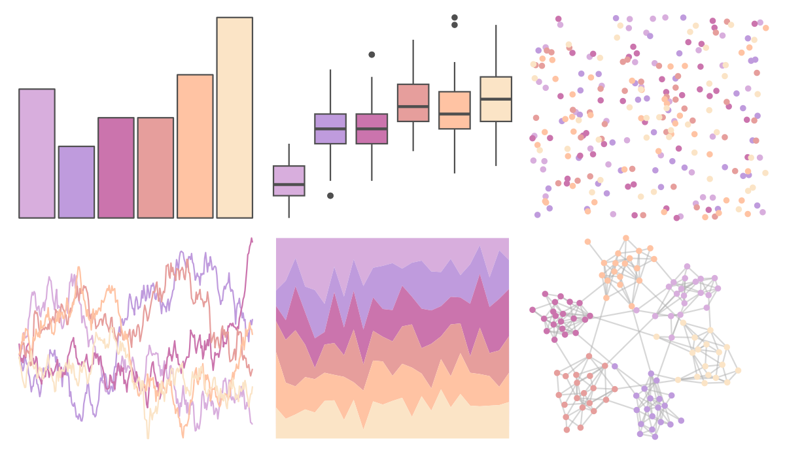

# PNWColors - Spring 

::: columns
::: {.column width="50%"}

**Github**

[jakelawlor/PNWColors](https://github.com/jakelawlor/PNWColors)
:::

::: {.column width="50%"}

**CRAN**

Not on CRAN
:::
:::

<hr> 

Use with [paletteer](https://emilhvitfeldt.github.io/paletteer/) package:

```r
library(paletteer)
paletteer_d("PNWColors::Spring")
```

Use raw:

```r
c("#D8AEDDFF", "#BF9BDDFF", "#CB74ADFF", "#E69E9CFF", "#FFC3A3FF", "#FBE4C6FF")
``` 

 

<br>

# Related Palettes

<div class="list" style="display: grid; grid-template-columns: auto auto auto;"> <figure class="figure">
<a href="../../awtools/a_palette/"> </a>
</figure> <figure class="figure">
<a href="../../trekcolors/lcars_2369/"> </a>
</figure> <figure class="figure">
<a href="../../MetBrewer/Morgenstern/"> </a>
</figure> <figure class="figure">
<a href="../../wesanderson/GrandBudapest2/"> </a>
</figure> <figure class="figure">
<a href="../../beyonce/X44/"> </a>
</figure> <figure class="figure">
<a href="../../rcartocolor/RedOr/"> </a>
</figure> <figure class="figure">
<a href="../../lisa/JohnSingerSargent_2/"> </a>
</figure> <figure class="figure">
<a href="../../fishualize/Xyrichthys_novacula/"> </a>
</figure> <figure class="figure">
<a href="../../Redmonder/sPBIRd/"> </a>
</figure> <figure class="figure">
<a href="../../palettetown/blissey/"> </a>
</figure> <figure class="figure">
<a href="../../NineteenEightyR/sonny/"> </a>
</figure> <figure class="figure">
<a href="../../fishualize/Harengula_jaguana/"> </a>
</figure> 
</div>
