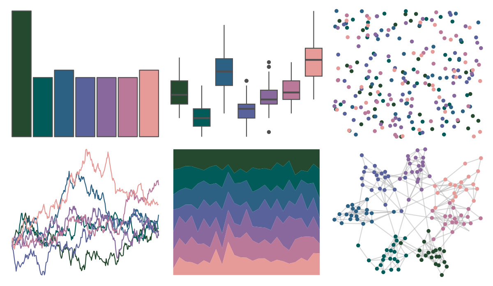

# PNWColors - Starfish 

::: columns
::: {.column width="50%"}

**Github**

[jakelawlor/PNWColors](https://github.com/jakelawlor/PNWColors)
:::

::: {.column width="50%"}

**CRAN**

Not on CRAN
:::
:::

<hr> 

Use with [paletteer](https://emilhvitfeldt.github.io/paletteer/) package:

```r
library(paletteer)
paletteer_d("PNWColors::Starfish")
```

Use raw:

```r
c("#24492EFF", "#015B58FF", "#2C6184FF", "#59629BFF", "#89689DFF", "#BA7999FF", "#E69B99FF")
``` 

 

<br>

# Related Palettes

<div class="list" style="display: grid; grid-template-columns: auto auto auto;"> <figure class="figure">
<a href="../../awtools/a_palette/"> </a>
</figure> <figure class="figure">
<a href="../../ButterflyColors/hamadryas_feronia/"> </a>
</figure> <figure class="figure">
<a href="../../ButterflyColors/hamadryas_feronia/"> </a>
</figure> <figure class="figure">
<a href="../../fishualize/Sparisoma_tuyupiranga_m/"> </a>
</figure> <figure class="figure">
<a href="../../MapPalettes/bruiser/"> </a>
</figure> <figure class="figure">
<a href="../../unikn/pal_unikn_dark/"> </a>
</figure> <figure class="figure">
<a href="../../beyonce/X108/"> </a>
</figure> <figure class="figure">
<a href="../../MetBrewer/Troy/"> </a>
</figure> <figure class="figure">
<a href="../../ggthemr/sky/"> </a>
</figure> <figure class="figure">
<a href="../../calecopal/superbloom3/"> </a>
</figure> <figure class="figure">
<a href="../../nbapalettes/hornets2/"> </a>
</figure> <figure class="figure">
<a href="../../MapPalettes/tealberry_pie/"> </a>
</figure> 
</div>
