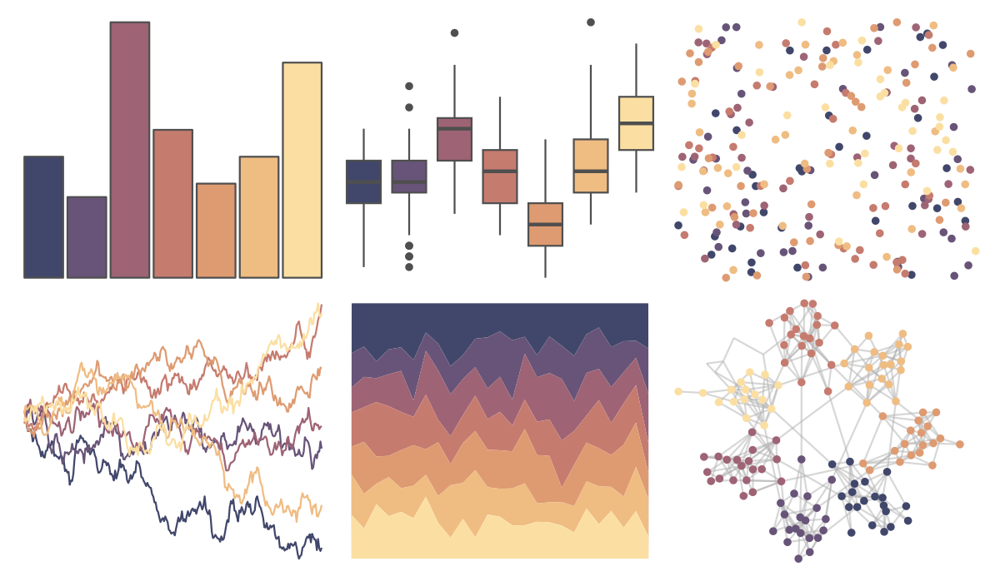

# PNWColors - Sunset 

::: columns
::: {.column width="50%"}

**Github**

[jakelawlor/PNWColors](https://github.com/jakelawlor/PNWColors)
:::

::: {.column width="50%"}

**CRAN**

Not on CRAN
:::
:::

<hr> 

Use with [paletteer](https://emilhvitfeldt.github.io/paletteer/) package:

```r
library(paletteer)
paletteer_d("PNWColors::Sunset")
```

Use raw:

```r
c("#41476BFF", "#675478FF", "#9E6374FF", "#C67B6FFF", "#DE9B71FF", "#EFBC82FF", "#FBDFA2FF")
``` 

 

<br>

# Related Palettes

<div class="list" style="display: grid; grid-template-columns: auto auto auto;"> <figure class="figure">
<a href="../../awtools/a_palette/"> </a>
</figure> <figure class="figure">
<a href="../../ButterflyColors/hamadryas_feronia/"> </a>
</figure> <figure class="figure">
<a href="../../ButterflyColors/hamadryas_feronia/"> </a>
</figure> <figure class="figure">
<a href="../../ghibli/PonyoMedium/"> </a>
</figure> <figure class="figure">
<a href="../../trekcolors/lcars_first_contact/"> </a>
</figure> <figure class="figure">
<a href="../../colRoz/grandis/"> </a>
</figure> <figure class="figure">
<a href="../../rcartocolor/Sunset/"> </a>
</figure> <figure class="figure">
<a href="../../nationalparkcolors/ChannelIslands/"> </a>
</figure> <figure class="figure">
<a href="../../NatParksPalettes/Acadia/"> </a>
</figure> <figure class="figure">
<a href="../../MetBrewer/Hokusai1/"> </a>
</figure> <figure class="figure">
<a href="../../lisa/JamesJean/"> </a>
</figure> <figure class="figure">
<a href="../../lisa/OskarSchlemmer/"> </a>
</figure> 
</div>
