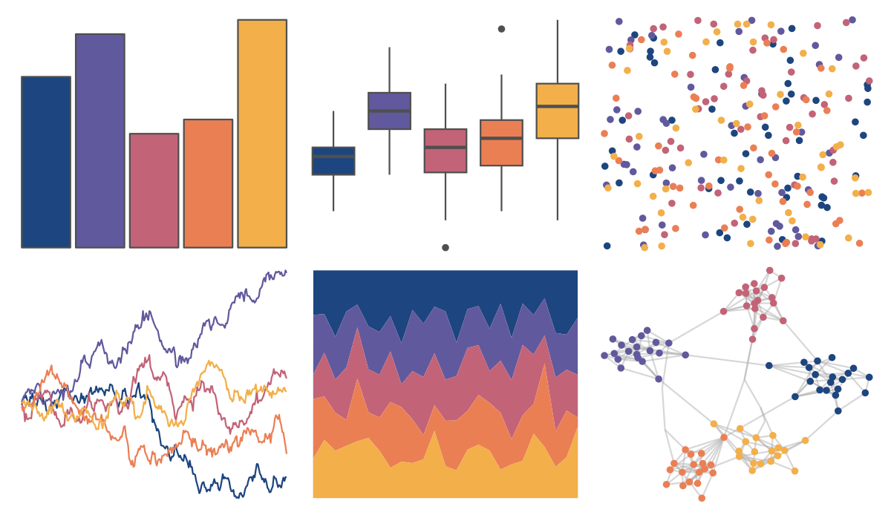
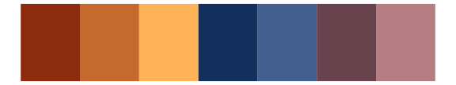

# PNWColors - Sunset2 

::: columns
::: {.column width="50%"}

**Github**

[jakelawlor/PNWColors](https://github.com/jakelawlor/PNWColors)
:::

::: {.column width="50%"}

**CRAN**

Not on CRAN
:::
:::

<hr> 

Use with [paletteer](https://emilhvitfeldt.github.io/paletteer/) package:

```r
library(paletteer)
paletteer_d("PNWColors::Sunset2")
```

Use raw:

```r
c("#1D457FFF", "#61599DFF", "#C36377FF", "#EB7F54FF", "#F2AF4AFF")
``` 

 

<br>

# Related Palettes

<div class="list" style="display: grid; grid-template-columns: auto auto auto;"> <figure class="figure">
<a href="../../amerika/Dem_Ind_Rep3/"> </a>
</figure> <figure class="figure">
<a href="../../lisa/JacobLawrence_1/"> </a>
</figure> <figure class="figure">
<a href="../../NatParksPalettes/DeathValley/"> </a>
</figure> <figure class="figure">
<a href="../../lisa/OskarSchlemmer/"> </a>
</figure> <figure class="figure">
<a href="../../nbapalettes/pelicans_city/"> </a>
</figure> <figure class="figure">
<a href="../../trekcolors/lcars_2375/"> </a>
</figure> <figure class="figure">
<a href="../../MetBrewer/Java/"> </a>
</figure> <figure class="figure">
<a href="../../colRoz/c_brevi/"> </a>
</figure> <figure class="figure">
<a href="../../NineteenEightyR/sunset1/"> </a>
</figure> <figure class="figure">
<a href="../../ltc/dora/"> </a>
</figure> <figure class="figure">
<a href="../../lisa/EdvardMunch/"> </a>
</figure> <figure class="figure">
<a href="../../fishualize/Paranthias_furcifer/"> </a>
</figure> 
</div>
