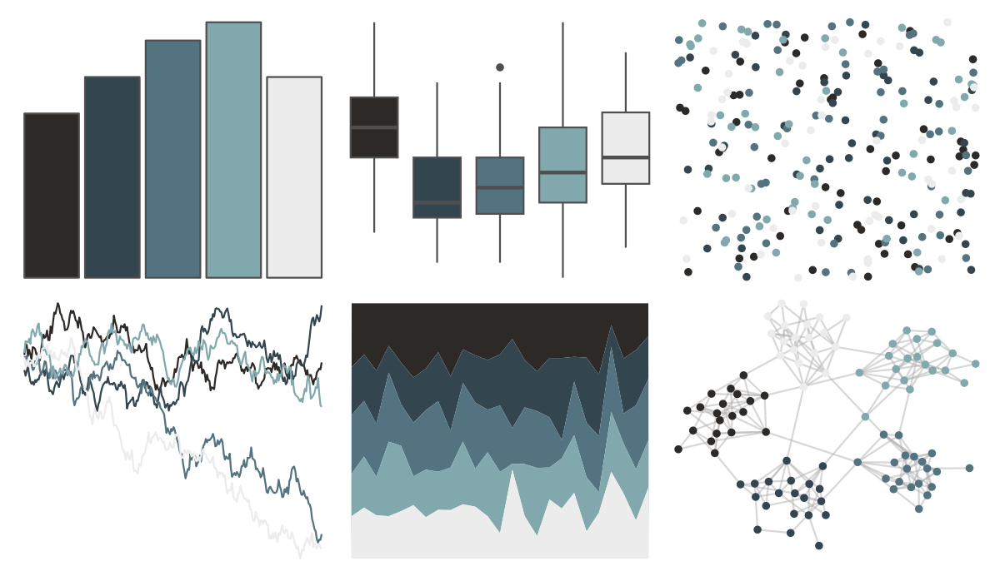

# PNWColors - Winter 

::: columns
::: {.column width="50%"}

**Github**

[jakelawlor/PNWColors](https://github.com/jakelawlor/PNWColors)
:::

::: {.column width="50%"}

**CRAN**

Not on CRAN
:::
:::

<hr> 

Use with [paletteer](https://emilhvitfeldt.github.io/paletteer/) package:

```r
library(paletteer)
paletteer_d("PNWColors::Winter")
```

Use raw:

```r
c("#2D2926FF", "#33454EFF", "#537380FF", "#81A9ADFF", "#ECECECFF")
``` 

 

<br>

# Related Palettes

<div class="list" style="display: grid; grid-template-columns: auto auto auto;"> <figure class="figure">
<a href="../../awtools/a_palette/"> </a>
</figure> <figure class="figure">
<a href="../../ButterflyColors/hamadryas_feronia/"> </a>
</figure> <figure class="figure">
<a href="../../ButterflyColors/hamadryas_feronia/"> </a>
</figure> <figure class="figure">
<a href="../../futurevisions/ceres/"> </a>
</figure> <figure class="figure">
<a href="../../futurevisions/pso/"> </a>
</figure> <figure class="figure">
<a href="../../tayloRswift/midnights/"> </a>
</figure> <figure class="figure">
<a href="../../trekcolors/andorian/"> </a>
</figure> <figure class="figure">
<a href="../../vangogh/Landscape/"> </a>
</figure> <figure class="figure">
<a href="../../severance/Half/"> </a>
</figure> <figure class="figure">
<a href="../../Redmonder/sPBIGy1/"> </a>
</figure> <figure class="figure">
<a href="../../musculusColors/ErWhale/"> </a>
</figure> <figure class="figure">
<a href="../../NatParksPalettes/CapitolReef/"> </a>
</figure> 
</div>
