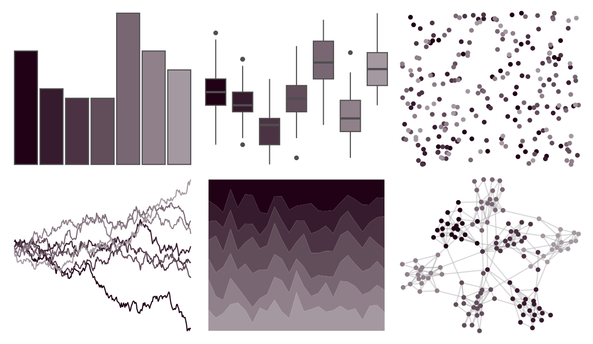

# PrettyCols - Aubergines 

::: columns
::: {.column width="50%"}

**Github**

[nrennie/PrettyCols](https://github.com/nrennie/PrettyCols)
:::

::: {.column width="50%"}

**CRAN**

[PrettyCols](https://CRAN.R-project.org/package=PrettyCols)
:::
:::

<hr> 

Use with [paletteer](https://emilhvitfeldt.github.io/paletteer/) package:

```r
library(paletteer)
paletteer_d("PrettyCols::Aubergines")
```

Use raw:

```r
c("#200116FF", "#361A2DFF", "#4C3344FF", "#624D5BFF", "#796673FF", "#8F808AFF", "#A599A1FF")
``` 

 

<br>

# Related Palettes

<div class="list" style="display: grid; grid-template-columns: auto auto auto;"> <figure class="figure">
<a href="../../amerika/Dem_Ind_Rep3/"> </a>
</figure> <figure class="figure">
<a href="../../beyonce/X68/"> </a>
</figure> <figure class="figure">
<a href="../../beyonce/X124/"> </a>
</figure> <figure class="figure">
<a href="../../ghibli/KikiDark/"> </a>
</figure> <figure class="figure">
<a href="../../beyonce/X84/"> </a>
</figure> <figure class="figure">
<a href="../../ghibli/PonyoDark/"> </a>
</figure> <figure class="figure">
<a href="../../ghibli/MarnieDark1/"> </a>
</figure> <figure class="figure">
<a href="../../beyonce/X57/"> </a>
</figure> <figure class="figure">
<a href="../../yarrr/eternal/"> </a>
</figure> <figure class="figure">
<a href="../../beyonce/X14/"> </a>
</figure> <figure class="figure">
<a href="../../colRoz/d_novae/"> </a>
</figure> <figure class="figure">
<a href="../../beyonce/X31/"> </a>
</figure> 
</div>
