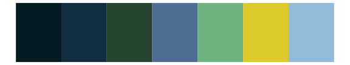

# PrettyCols - Aurora 

::: columns
::: {.column width="50%"}

**Github**

[nrennie/PrettyCols](https://github.com/nrennie/PrettyCols)
:::

::: {.column width="50%"}

**CRAN**

[PrettyCols](https://CRAN.R-project.org/package=PrettyCols)
:::
:::

<hr> 

Use with [paletteer](https://emilhvitfeldt.github.io/paletteer/) package:

```r
library(paletteer)
paletteer_d("PrettyCols::Aurora")
```

Use raw:

```r
c("#53113FFF", "#6C1A41FF", "#ABEF07FF", "#059C59FF", "#295542FF", "#5C8797FF")
``` 

 

<br>

# Related Palettes

<div class="list" style="display: grid; grid-template-columns: auto auto auto;"> <figure class="figure">
<a href="../../amerika/Dem_Ind_Rep3/"> </a>
</figure> <figure class="figure">
<a href="../../ggprism/viridis/"> </a>
</figure> <figure class="figure">
<a href="../../MoMAColors/VanGogh/"> </a>
</figure> <figure class="figure">
<a href="../../ghibli/YesterdayMedium/"> </a>
</figure> <figure class="figure">
<a href="../../poisonfrogs/Rvariabilis/"> </a>
</figure> <figure class="figure">
<a href="../../nbapalettes/timberwolves/"> </a>
</figure> <figure class="figure">
<a href="../../lisa/VincentvanGogh/"> </a>
</figure> <figure class="figure">
<a href="../../poisonfrogs/Amacero/"> </a>
</figure> <figure class="figure">
<a href="../../fishualize/Gomphosus_varius/"> </a>
</figure> <figure class="figure">
<a href="../../poisonfrogs/Dauratus/"> </a>
</figure> <figure class="figure">
<a href="../../NatParksPalettes/Denali/"> </a>
</figure> <figure class="figure">
<a href="../../rtist/hopper/"> </a>
</figure> 
</div>
