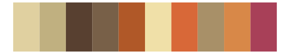

# PrettyCols - Autumn 

::: columns
::: {.column width="50%"}

**Github**

[nrennie/PrettyCols](https://github.com/nrennie/PrettyCols)
:::

::: {.column width="50%"}

**CRAN**

[PrettyCols](https://CRAN.R-project.org/package=PrettyCols)
:::
:::

<hr> 

Use with [paletteer](https://emilhvitfeldt.github.io/paletteer/) package:

```r
library(paletteer)
paletteer_d("PrettyCols::Autumn")
```

Use raw:

```r
c("#915646FF", "#BA6E1DFF", "#CA9C2FFF", "#905C23FF", "#DBB053FF", "#5D6538FF", "#A14E17FF", "#7F603EFF", "#DA8E28FF", "#917836FF", "#972C0BFF", "#5A4E3EFF")
``` 

 

<br>

# Related Palettes

<div class="list" style="display: grid; grid-template-columns: auto auto auto;"> <figure class="figure">
<a href="../../amerika/Dem_Ind_Rep3/"> </a>
</figure> <figure class="figure">
<a href="../../ggprism/beer_and_ales/"> </a>
</figure> <figure class="figure">
<a href="../../Redmonder/qMSORd/"> </a>
</figure> <figure class="figure">
<a href="../../IslamicArt/istanbul3/"> </a>
</figure> <figure class="figure">
<a href="../../ggthemes/excel_Red/"> </a>
</figure> <figure class="figure">
<a href="../../nord/moose_pond/"> </a>
</figure> <figure class="figure">
<a href="../../palettetown/spinda/"> </a>
</figure> <figure class="figure">
<a href="../../lisa/CharlesDemuth/"> </a>
</figure> <figure class="figure">
<a href="../../palettetown/lunatone/"> </a>
</figure> <figure class="figure">
<a href="../../DresdenColor/graveperil/"> </a>
</figure> <figure class="figure">
<a href="../../Redmonder/qMSOYlOr/"> </a>
</figure> <figure class="figure">
<a href="../../ggthemes/excel_Yellow_Orange/"> </a>
</figure> 
</div>
