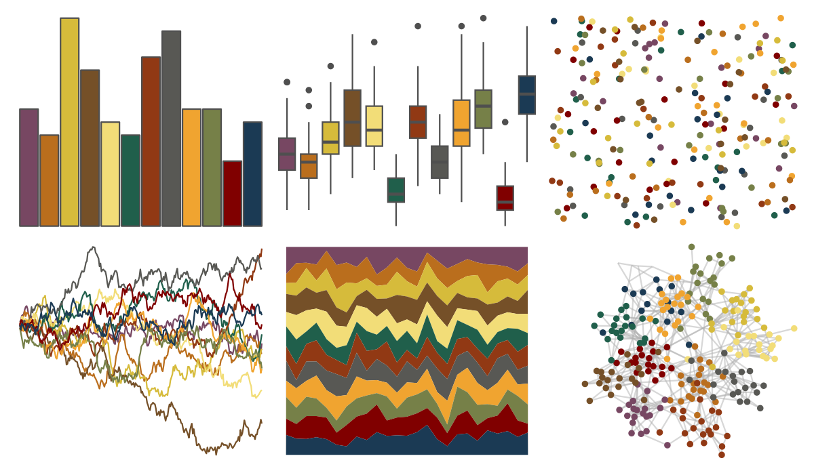

# PrettyCols - Autumn 

::: columns
::: {.column width="50%"}

**Github**

[nrennie/PrettyCols](https://github.com/nrennie/PrettyCols)
:::

::: {.column width="50%"}

**CRAN**

[PrettyCols](https://CRAN.R-project.org/package=PrettyCols)
:::
:::

<hr> 

Use with [paletteer](https://emilhvitfeldt.github.io/paletteer/) package:

```r
library(paletteer)
paletteer_d("PrettyCols::Autumn")
```

Use raw:

```r
c("#774762FF", "#BA6E1DFF", "#D6BB3BFF", "#755028FF", "#F2DD78FF", "#205F4BFF", "#913914FF", "#585854FF", "#F0A430FF", "#768048FF", "#800000FF", "#1B3A54FF")
``` 

 

<br>

# Related Palettes

<div class="list" style="display: grid; grid-template-columns: auto auto auto;"> <figure class="figure">
<a href="../../awtools/a_palette/"> </a>
</figure> <figure class="figure">
<a href="../../ButterflyColors/hamadryas_feronia/"> </a>
</figure> <figure class="figure">
<a href="../../ButterflyColors/hamadryas_feronia/"> </a>
</figure> <figure class="figure">
<a href="../../ggthemr/pale/"> </a>
</figure> <figure class="figure">
<a href="../../ggsci/default_uchicago/"> </a>
</figure> <figure class="figure">
<a href="../../ochRe/olsen_seq/"> </a>
</figure> <figure class="figure">
<a href="../../MoMAColors/Klein/"> </a>
</figure> <figure class="figure">
<a href="../../impressionist.colors/le_dejeuner_des_canotiers/"> </a>
</figure> <figure class="figure">
<a href="../../MetBrewer/Redon/"> </a>
</figure> <figure class="figure">
<a href="../../ggsci/default_jco/"> </a>
</figure> <figure class="figure">
<a href="../../PrettyCols/Summer/"> </a>
</figure> <figure class="figure">
<a href="../../feathers/yellow_robin/"> </a>
</figure> 
</div>
