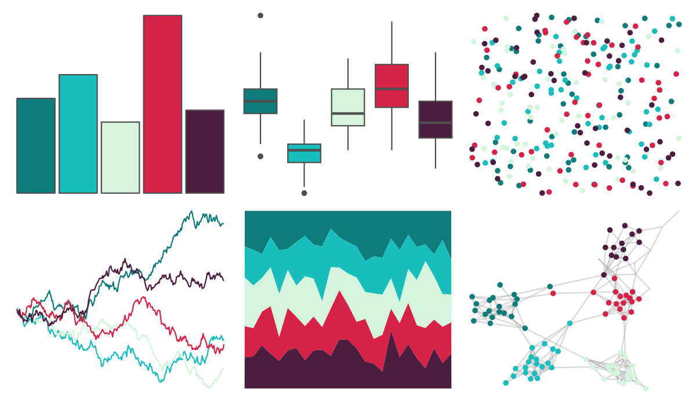

# PrettyCols - Beach 

::: columns
::: {.column width="50%"}

**Github**

[nrennie/PrettyCols](https://github.com/nrennie/PrettyCols)
:::

::: {.column width="50%"}

**CRAN**

[PrettyCols](https://CRAN.R-project.org/package=PrettyCols)
:::
:::

<hr> 

Use with [paletteer](https://emilhvitfeldt.github.io/paletteer/) package:

```r
library(paletteer)
paletteer_d("PrettyCols::Beach")
```

Use raw:

```r
c("#0E7C7BFF", "#17BEBBFF", "#D4F4DDFF", "#D62246FF", "#4B1D3FFF")
``` 

 

<br>

# Related Palettes

<div class="list" style="display: grid; grid-template-columns: auto auto auto;"> <figure class="figure">
<a href="../../amerika/Dem_Ind_Rep3/"> </a>
</figure> <figure class="figure">
<a href="../../nbapalettes/grizzlies_europe/"> </a>
</figure> <figure class="figure">
<a href="../../vapoRwave/macPlus/"> </a>
</figure> <figure class="figure">
<a href="../../vapeplot/macplus/"> </a>
</figure> <figure class="figure">
<a href="../../fishualize/Hypsoblennius_invemar/"> </a>
</figure> <figure class="figure">
<a href="../../LaCroixColoR/Coconut/"> </a>
</figure> <figure class="figure">
<a href="../../LaCroixColoR/Pamplemousse/"> </a>
</figure> <figure class="figure">
<a href="../../IslamicArt/ottoman/"> </a>
</figure> <figure class="figure">
<a href="../../PrettyCols/Fun/"> </a>
</figure> <figure class="figure">
<a href="../../fishualize/Thalassoma_hardwicke/"> </a>
</figure> <figure class="figure">
<a href="../../rockthemes/nodoubt/"> </a>
</figure> <figure class="figure">
<a href="../../LaCroixColoR/PassionFruit/"> </a>
</figure> 
</div>
