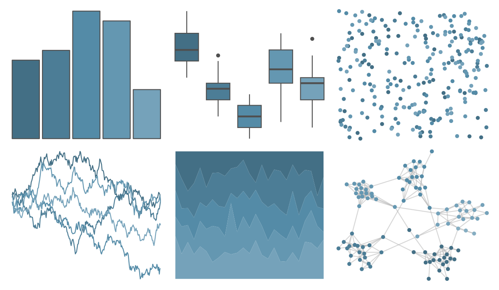

# PrettyCols - Blues 

::: columns
::: {.column width="50%"}

**Github**

[nrennie/PrettyCols](https://github.com/nrennie/PrettyCols)
:::

::: {.column width="50%"}

**CRAN**

[PrettyCols](https://CRAN.R-project.org/package=PrettyCols)
:::
:::

<hr> 

Use with [paletteer](https://emilhvitfeldt.github.io/paletteer/) package:

```r
library(paletteer)
paletteer_d("PrettyCols::Blues")
```

Use raw:

```r
c("#436F85FF", "#4C7D96FF", "#548BA7FF", "#6497B1FF", "#75A2BAFF", "#86AEC2FF", "#97B9CBFF")
``` 

 

<br>

# Related Palettes

<div class="list" style="display: grid; grid-template-columns: auto auto auto;"> <figure class="figure">
<a href="../../awtools/a_palette/"> </a>
</figure> <figure class="figure">
<a href="../../ButterflyColors/hamadryas_feronia/"> </a>
</figure> <figure class="figure">
<a href="../../ButterflyColors/hamadryas_feronia/"> </a>
</figure> <figure class="figure">
<a href="../../nord/frost/"> </a>
</figure> <figure class="figure">
<a href="../../ggthemes/excel_Violet/"> </a>
</figure> <figure class="figure">
<a href="../../unikn/pal_karpfenblau/"> </a>
</figure> <figure class="figure">
<a href="../../ggthemes/excel_Blue_Warm/"> </a>
</figure> <figure class="figure">
<a href="../../rcartocolor/Teal/"> </a>
</figure> <figure class="figure">
<a href="../../severance/Half/"> </a>
</figure> <figure class="figure">
<a href="../../colRoz/sky/"> </a>
</figure> <figure class="figure">
<a href="../../fishualize/Opisthonema_oglinum/"> </a>
</figure> <figure class="figure">
<a href="../../musculusColors/ErMole/"> </a>
</figure> 
</div>
