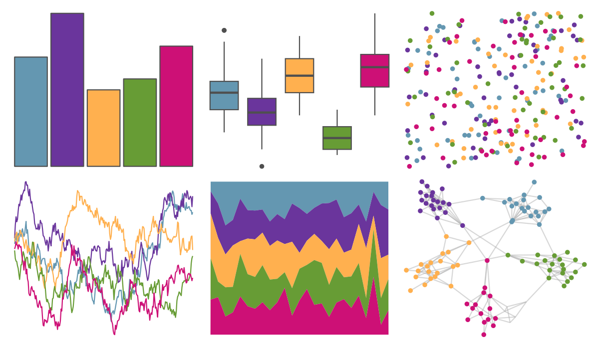

# PrettyCols - Bold 

::: columns
::: {.column width="50%"}

**Github**

[nrennie/PrettyCols](https://github.com/nrennie/PrettyCols)
:::

::: {.column width="50%"}

**CRAN**

[PrettyCols](https://CRAN.R-project.org/package=PrettyCols)
:::
:::

<hr> 

Use with [paletteer](https://emilhvitfeldt.github.io/paletteer/) package:

```r
library(paletteer)
paletteer_d("PrettyCols::Bold")
```

Use raw:

```r
c("#6497B1FF", "#6A359CFF", "#FFB04FFF", "#679C35FF", "#CD1076FF")
``` 

 

<br>

# Related Palettes

<div class="list" style="display: grid; grid-template-columns: auto auto auto;"> <figure class="figure">
<a href="../../amerika/Dem_Ind_Rep3/"> </a>
</figure> <figure class="figure">
<a href="../../fishualize/Scarus_quoyi/"> </a>
</figure> <figure class="figure">
<a href="../../RSkittleBrewer/wildberry/"> </a>
</figure> <figure class="figure">
<a href="../../waRhol/bighorn_ram_83/"> </a>
</figure> <figure class="figure">
<a href="../../MoMAColors/Ohchi/"> </a>
</figure> <figure class="figure">
<a href="../../PrettyCols/Relax/"> </a>
</figure> <figure class="figure">
<a href="../../ggsci/categorical8_atlassian/"> </a>
</figure> <figure class="figure">
<a href="../../nbapalettes/pacers_foundation/"> </a>
</figure> <figure class="figure">
<a href="../../fishualize/Bodianus_rufus/"> </a>
</figure> <figure class="figure">
<a href="../../palettetown/starterspairs/"> </a>
</figure> <figure class="figure">
<a href="../../MetBrewer/Klimt/"> </a>
</figure> <figure class="figure">
<a href="../../ggthemes/excel_Office_2007_2010/"> </a>
</figure> 
</div>
