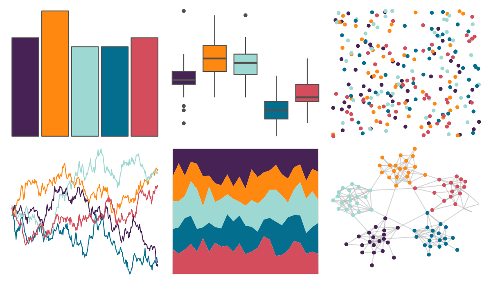

# PrettyCols - Bright 

::: columns
::: {.column width="50%"}

**Github**

[nrennie/PrettyCols](https://github.com/nrennie/PrettyCols)
:::

::: {.column width="50%"}

**CRAN**

[PrettyCols](https://CRAN.R-project.org/package=PrettyCols)
:::
:::

<hr> 

Use with [paletteer](https://emilhvitfeldt.github.io/paletteer/) package:

```r
library(paletteer)
paletteer_d("PrettyCols::Bright")
```

Use raw:

```r
c("#462255FF", "#FF8811FF", "#9DD9D2FF", "#046E8FFF", "#D44D5CFF")
``` 

 

<br>

# Related Palettes

<div class="list" style="display: grid; grid-template-columns: auto auto auto;"> <figure class="figure">
<a href="../../amerika/Dem_Ind_Rep3/"> </a>
</figure> <figure class="figure">
<a href="../../suffrager/oxon/"> </a>
</figure> <figure class="figure">
<a href="../../fishualize/Lampris_guttatus/"> </a>
</figure> <figure class="figure">
<a href="../../rockthemes/nodoubt/"> </a>
</figure> <figure class="figure">
<a href="../../PrettyCols/Celestial/"> </a>
</figure> <figure class="figure">
<a href="../../IslamicArt/samarqand2/"> </a>
</figure> <figure class="figure">
<a href="../../IslamicArt/ottoman/"> </a>
</figure> <figure class="figure">
<a href="../../fishualize/Serranus_scriba/"> </a>
</figure> <figure class="figure">
<a href="../../nbapalettes/knicks_city2/"> </a>
</figure> <figure class="figure">
<a href="../../futurevisions/atomic_clock/"> </a>
</figure> <figure class="figure">
<a href="../../khroma/vibrant/"> </a>
</figure> <figure class="figure">
<a href="../../LaCroixColoR/Coconut/"> </a>
</figure> 
</div>
