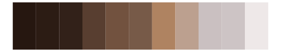

# PrettyCols - Browns 

::: columns
::: {.column width="50%"}

**Github**

[nrennie/PrettyCols](https://github.com/nrennie/PrettyCols)
:::

::: {.column width="50%"}

**CRAN**

[PrettyCols](https://CRAN.R-project.org/package=PrettyCols)
:::
:::

<hr> 

Use with [paletteer](https://emilhvitfeldt.github.io/paletteer/) package:

```r
library(paletteer)
paletteer_d("PrettyCols::Browns")
```

Use raw:

```r
c("#24140EFF", "#542F22FF", "#844A36FF", "#B4654AFF", "#C88E7AFF", "#DCB7AAFF", "#F0E0DAFF")
``` 

 

<br>

# Related Palettes

<div class="list" style="display: grid; grid-template-columns: auto auto auto;"> <figure class="figure">
<a href="../../amerika/Dem_Ind_Rep3/"> </a>
</figure> <figure class="figure">
<a href="../../NatParksPalettes/WindCave/"> </a>
</figure> <figure class="figure">
<a href="../../soilpalettes/alaquod/"> </a>
</figure> <figure class="figure">
<a href="../../beyonce/X24/"> </a>
</figure> <figure class="figure">
<a href="../../fishualize/Semicossyphus_pulcher/"> </a>
</figure> <figure class="figure">
<a href="../../rcartocolor/BrwnYl/"> </a>
</figure> <figure class="figure">
<a href="../../wesanderson/IsleofDogs2/"> </a>
</figure> <figure class="figure">
<a href="../../tayloRswift/midnightsBloodMoon/"> </a>
</figure> <figure class="figure">
<a href="../../beyonce/X85/"> </a>
</figure> <figure class="figure">
<a href="../../beyonce/X46/"> </a>
</figure> <figure class="figure">
<a href="../../colRoz/e_kingii/"> </a>
</figure> <figure class="figure">
<a href="../../ButterflyColors/danaus_eresimus/"> </a>
</figure> 
</div>
