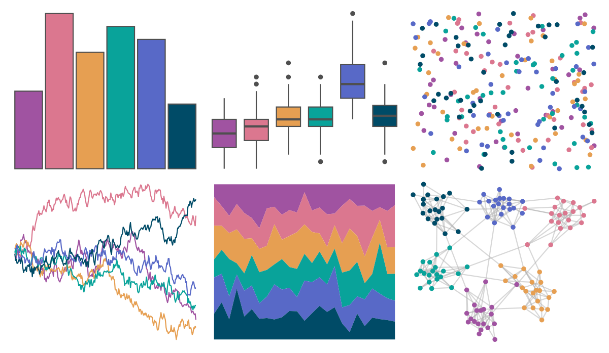

# PrettyCols - Celestial 

::: columns
::: {.column width="50%"}

**Github**

[nrennie/PrettyCols](https://github.com/nrennie/PrettyCols)
:::

::: {.column width="50%"}

**CRAN**

[PrettyCols](https://CRAN.R-project.org/package=PrettyCols)
:::
:::

<hr> 

Use with [paletteer](https://emilhvitfeldt.github.io/paletteer/) package:

```r
library(paletteer)
paletteer_d("PrettyCols::Celestial")
```

Use raw:

```r
c("#A053A1FF", "#DB778FFF", "#E69F52FF", "#09A39AFF", "#5869C7FF", "#004B67FF")
``` 

 

<br>

# Related Palettes

<div class="list" style="display: grid; grid-template-columns: auto auto auto;"> <figure class="figure">
<a href="../../amerika/Dem_Ind_Rep3/"> </a>
</figure> <figure class="figure">
<a href="../../ggthemr/solarized/"> </a>
</figure> <figure class="figure">
<a href="../../suffrager/oxon/"> </a>
</figure> <figure class="figure">
<a href="../../PrettyCols/Lively/"> </a>
</figure> <figure class="figure">
<a href="../../ltc/minou/"> </a>
</figure> <figure class="figure">
<a href="../../calecopal/superbloom3/"> </a>
</figure> <figure class="figure">
<a href="../../ggsci/default_jama/"> </a>
</figure> <figure class="figure">
<a href="../../ggsci/default_nejm/"> </a>
</figure> <figure class="figure">
<a href="../../beyonce/X49/"> </a>
</figure> <figure class="figure">
<a href="../../MoMAColors/Sidhu/"> </a>
</figure> <figure class="figure">
<a href="../../PrettyCols/Bright/"> </a>
</figure> <figure class="figure">
<a href="../../peRReo/badbunny1/"> </a>
</figure> 
</div>
