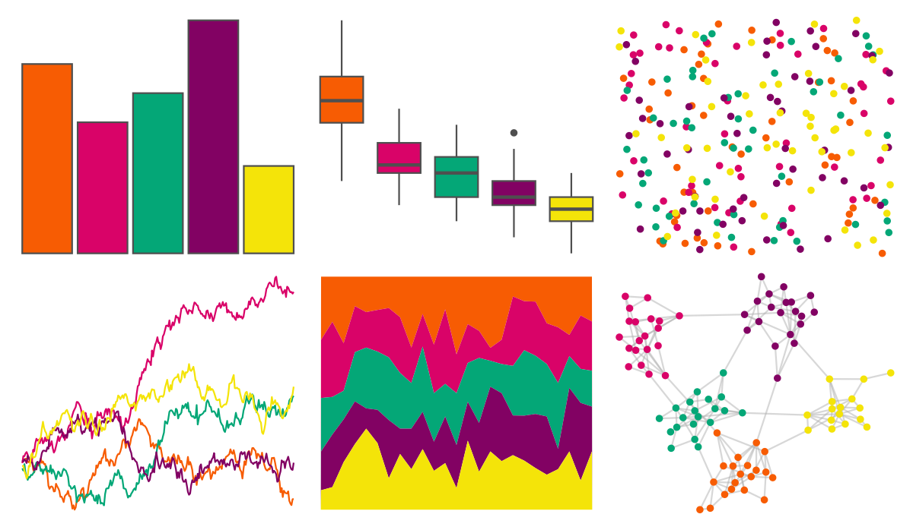

# PrettyCols - Disco 

::: columns
::: {.column width="50%"}

**Github**

[nrennie/PrettyCols](https://github.com/nrennie/PrettyCols)
:::

::: {.column width="50%"}

**CRAN**

[PrettyCols](https://CRAN.R-project.org/package=PrettyCols)
:::
:::

<hr> 

Use with [paletteer](https://emilhvitfeldt.github.io/paletteer/) package:

```r
library(paletteer)
paletteer_d("PrettyCols::Disco")
```

Use raw:

```r
c("#F75C03FF", "#D90368FF", "#04A777FF", "#820263FF", "#F4E409FF")
``` 

 

<br>

# Related Palettes

<div class="list" style="display: grid; grid-template-columns: auto auto auto;"> <figure class="figure">
<a href="../../amerika/Dem_Ind_Rep3/"> </a>
</figure> <figure class="figure">
<a href="../../ggthemes/excel_Slice/"> </a>
</figure> <figure class="figure">
<a href="../../MoMAColors/OKeeffe/"> </a>
</figure> <figure class="figure">
<a href="../../MetBrewer/Johnson/"> </a>
</figure> <figure class="figure">
<a href="../../PNWColors/Bay/"> </a>
</figure> <figure class="figure">
<a href="../../nbapalettes/thunder_city2/"> </a>
</figure> <figure class="figure">
<a href="../../jcolors/pal2/"> </a>
</figure> <figure class="figure">
<a href="../../ggprism/plasma/"> </a>
</figure> <figure class="figure">
<a href="../../awtools/spalette/"> </a>
</figure> <figure class="figure">
<a href="../../ggprism/inferno/"> </a>
</figure> <figure class="figure">
<a href="../../soilpalettes/redox2/"> </a>
</figure> <figure class="figure">
<a href="../../RSkittleBrewer/smarties/"> </a>
</figure> 
</div>
