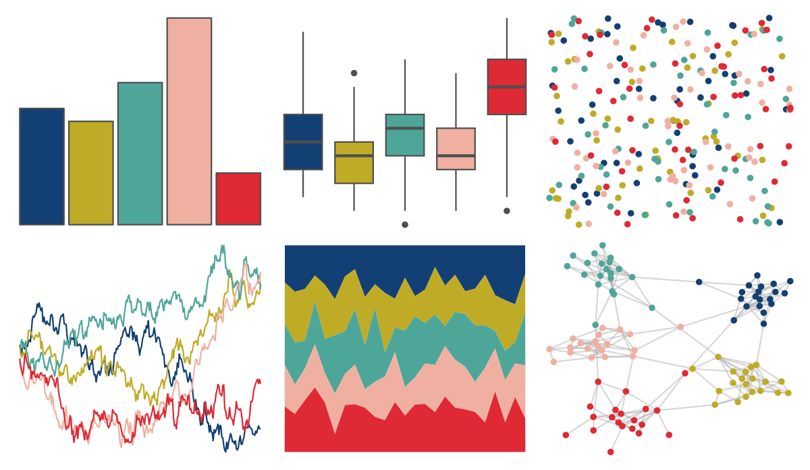

# PrettyCols - Fun 

::: columns
::: {.column width="50%"}

**Github**

[nrennie/PrettyCols](https://github.com/nrennie/PrettyCols)
:::

::: {.column width="50%"}

**CRAN**

[PrettyCols](https://CRAN.R-project.org/package=PrettyCols)
:::
:::

<hr> 

Use with [paletteer](https://emilhvitfeldt.github.io/paletteer/) package:

```r
library(paletteer)
paletteer_d("PrettyCols::Fun")
```

Use raw:

```r
c("#134074FF", "#BFAB25FF", "#4EA699FF", "#EFB0A1FF", "#DF2935FF")
``` 

 

<br>

# Related Palettes

<div class="list" style="display: grid; grid-template-columns: auto auto auto;"> <figure class="figure">
<a href="../../awtools/a_palette/"> </a>
</figure> <figure class="figure">
<a href="../../ButterflyColors/hamadryas_feronia/"> </a>
</figure> <figure class="figure">
<a href="../../ButterflyColors/hamadryas_feronia/"> </a>
</figure> <figure class="figure">
<a href="../../lisa/PaulFeeley/"> </a>
</figure> <figure class="figure">
<a href="../../rockthemes/nodoubt/"> </a>
</figure> <figure class="figure">
<a href="../../lisa/ClaesOldenburg/"> </a>
</figure> <figure class="figure">
<a href="../../rtist/oldenburg/"> </a>
</figure> <figure class="figure">
<a href="../../fishualize/Etheostoma_spectabile/"> </a>
</figure> <figure class="figure">
<a href="../../lisa/MarcChagall/"> </a>
</figure> <figure class="figure">
<a href="../../MetBrewer/Egypt/"> </a>
</figure> <figure class="figure">
<a href="../../fishualize/Epibulus_insidiator/"> </a>
</figure> <figure class="figure">
<a href="../../rockthemes/californication/"> </a>
</figure> 
</div>
