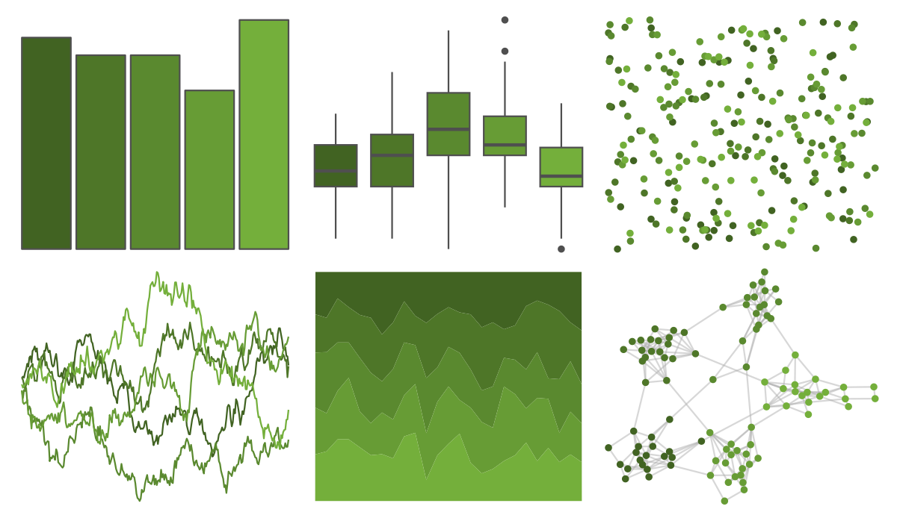
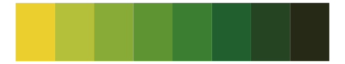
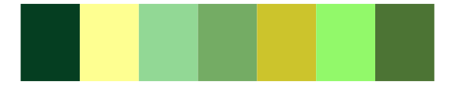

# PrettyCols - Greens 

::: columns
::: {.column width="50%"}

**Github**

[nrennie/PrettyCols](https://github.com/nrennie/PrettyCols)
:::

::: {.column width="50%"}

**CRAN**

[PrettyCols](https://CRAN.R-project.org/package=PrettyCols)
:::
:::

<hr> 

Use with [paletteer](https://emilhvitfeldt.github.io/paletteer/) package:

```r
library(paletteer)
paletteer_d("PrettyCols::Greens")
```

Use raw:

```r
c("#416322FF", "#4E7628FF", "#5A892FFF", "#679C35FF", "#74AF3BFF", "#80C044FF", "#8DC657FF")
``` 

 

<br>

# Related Palettes

<div class="list" style="display: grid; grid-template-columns: auto auto auto;"> <figure class="figure">
<a href="../../amerika/Dem_Ind_Rep3/"> </a>
</figure> <figure class="figure">
<a href="../../fishualize/Gymnothorax_funebris/"> </a>
</figure> <figure class="figure">
<a href="../../ggsci/light_green_material/"> </a>
</figure> <figure class="figure">
<a href="../../palettetown/cacturne/"> </a>
</figure> <figure class="figure">
<a href="../../ggsci/green_material/"> </a>
</figure> <figure class="figure">
<a href="../../MoMAColors/Alkalay2/"> </a>
</figure> <figure class="figure">
<a href="../../ggsci/lime_material/"> </a>
</figure> <figure class="figure">
<a href="../../ggprism/mustard_field/"> </a>
</figure> <figure class="figure">
<a href="../../ggsci/lime_tw3/"> </a>
</figure> <figure class="figure">
<a href="../../tvthemes/Peridot/"> </a>
</figure> <figure class="figure">
<a href="../../fishualize/Prognathodes_brasiliensis/"> </a>
</figure> <figure class="figure">
<a href="../../palettetown/diglett/"> </a>
</figure> 
</div>
