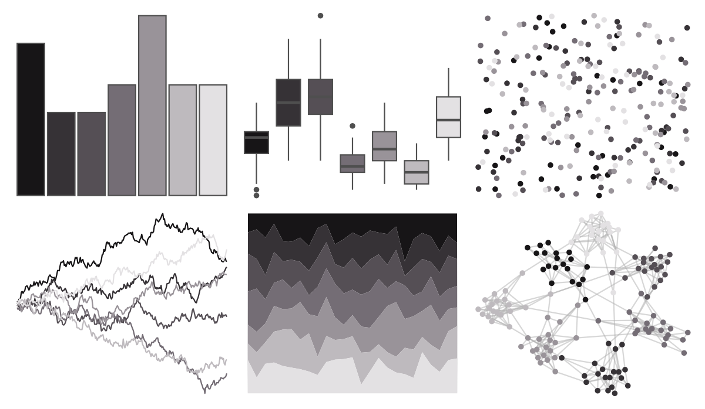

# PrettyCols - Greys 

::: columns
::: {.column width="50%"}

**Github**

[nrennie/PrettyCols](https://github.com/nrennie/PrettyCols)
:::

::: {.column width="50%"}

**CRAN**

[PrettyCols](https://CRAN.R-project.org/package=PrettyCols)
:::
:::

<hr> 

Use with [paletteer](https://emilhvitfeldt.github.io/paletteer/) package:

```r
library(paletteer)
paletteer_d("PrettyCols::Greys")
```

Use raw:

```r
c("#171517FF", "#363236FF", "#554F55FF", "#746D75FF", "#999399FF", "#BEBABEFF", "#E3E1E3FF")
``` 

 

<br>

# Related Palettes

<div class="list" style="display: grid; grid-template-columns: auto auto auto;"> <figure class="figure">
<a href="../../amerika/Dem_Ind_Rep3/"> </a>
</figure> <figure class="figure">
<a href="../../trekcolors/borg/"> </a>
</figure> <figure class="figure">
<a href="../../NatParksPalettes/CapitolReef/"> </a>
</figure> <figure class="figure">
<a href="../../Rdune/corrino/"> </a>
</figure> <figure class="figure">
<a href="../../tayloRswift/folklore/"> </a>
</figure> <figure class="figure">
<a href="../../colRoz/kimberley/"> </a>
</figure> <figure class="figure">
<a href="../../ggsci/neutral_tw3/"> </a>
</figure> <figure class="figure">
<a href="../../tayloRswift/reputation/"> </a>
</figure> <figure class="figure">
<a href="../../awtools/gpalette/"> </a>
</figure> <figure class="figure">
<a href="../../Redmonder/sPBIGy1/"> </a>
</figure> <figure class="figure">
<a href="../../beyonce/X122/"> </a>
</figure> <figure class="figure">
<a href="../../fishualize/Semicossyphus_pulcher/"> </a>
</figure> 
</div>
