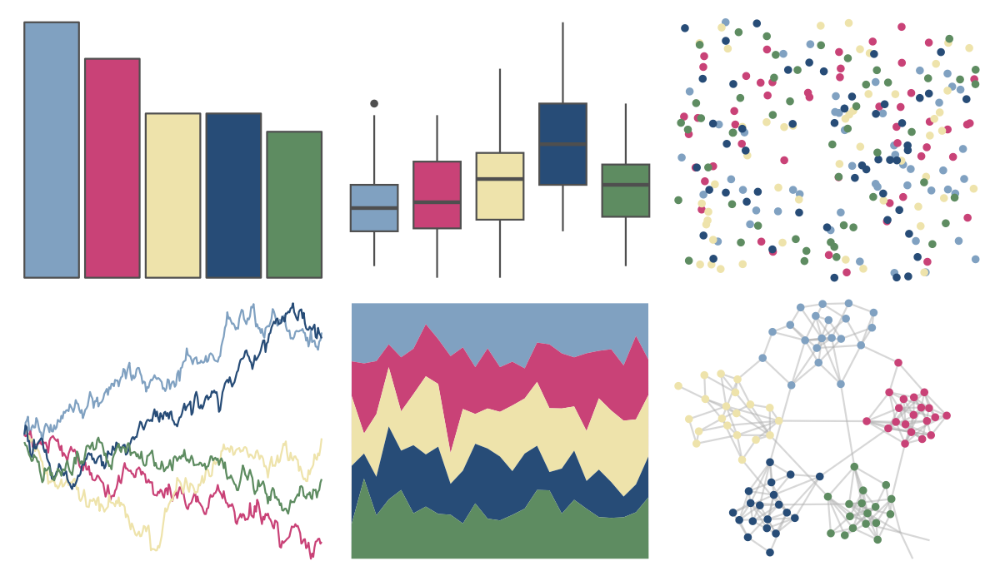

# PrettyCols - Joyful 

::: columns
::: {.column width="50%"}

**Github**

[nrennie/PrettyCols](https://github.com/nrennie/PrettyCols)
:::

::: {.column width="50%"}

**CRAN**

[PrettyCols](https://CRAN.R-project.org/package=PrettyCols)
:::
:::

<hr> 

Use with [paletteer](https://emilhvitfeldt.github.io/paletteer/) package:

```r
library(paletteer)
paletteer_d("PrettyCols::Joyful")
```

Use raw:

```r
c("#80A1C1FF", "#C94277FF", "#EEE3ABFF", "#274C77FF", "#5E8C61FF")
``` 

 

<br>

# Related Palettes

<div class="list" style="display: grid; grid-template-columns: auto auto auto;"> <figure class="figure">
<a href="../../awtools/a_palette/"> </a>
</figure> <figure class="figure">
<a href="../../ButterflyColors/hamadryas_feronia/"> </a>
</figure> <figure class="figure">
<a href="../../ButterflyColors/hamadryas_feronia/"> </a>
</figure> <figure class="figure">
<a href="../../MexBrewer/Casita1/"> </a>
</figure> <figure class="figure">
<a href="../../khroma/bright/"> </a>
</figure> <figure class="figure">
<a href="../../MetBrewer/Klimt/"> </a>
</figure> <figure class="figure">
<a href="../../lisa/TheovanDoesburg/"> </a>
</figure> <figure class="figure">
<a href="../../colRoz/i_lesueurii/"> </a>
</figure> <figure class="figure">
<a href="../../lisa/JacksonPollock/"> </a>
</figure> <figure class="figure">
<a href="../../rtist/pollock/"> </a>
</figure> <figure class="figure">
<a href="../../lisa/EdwardHopper/"> </a>
</figure> <figure class="figure">
<a href="../../DresdenColor/ghoststory/"> </a>
</figure> 
</div>
