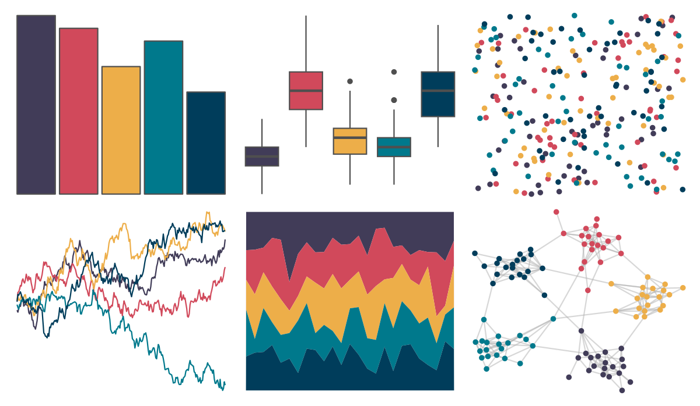

# PrettyCols - Lively 

::: columns
::: {.column width="50%"}

**Github**

[nrennie/PrettyCols](https://github.com/nrennie/PrettyCols)
:::

::: {.column width="50%"}

**CRAN**

[PrettyCols](https://CRAN.R-project.org/package=PrettyCols)
:::
:::

<hr> 

Use with [paletteer](https://emilhvitfeldt.github.io/paletteer/) package:

```r
library(paletteer)
paletteer_d("PrettyCols::Lively")
```

Use raw:

```r
c("#413C58FF", "#D1495BFF", "#EDAE49FF", "#00798CFF", "#003D5BFF")
``` 

 

<br>

# Related Palettes

<div class="list" style="display: grid; grid-template-columns: auto auto auto;"> <figure class="figure">
<a href="../../amerika/Dem_Ind_Rep3/"> </a>
</figure> <figure class="figure">
<a href="../../calecopal/superbloom3/"> </a>
</figure> <figure class="figure">
<a href="../../ggthemr/solarized/"> </a>
</figure> <figure class="figure">
<a href="../../poisonfrogs/Opsancristobal/"> </a>
</figure> <figure class="figure">
<a href="../../nbapalettes/grizzlies/"> </a>
</figure> <figure class="figure">
<a href="../../NatParksPalettes/DeathValley/"> </a>
</figure> <figure class="figure">
<a href="../../PrettyCols/Celestial/"> </a>
</figure> <figure class="figure">
<a href="../../PrettyCols/Dark/"> </a>
</figure> <figure class="figure">
<a href="../../colRoz/m_horridus/"> </a>
</figure> <figure class="figure">
<a href="../../ltc/pantone23/"> </a>
</figure> <figure class="figure">
<a href="../../nbapalettes/thunder_city/"> </a>
</figure> <figure class="figure">
<a href="../../ggthemes/excel_Aspect/"> </a>
</figure> 
</div>
