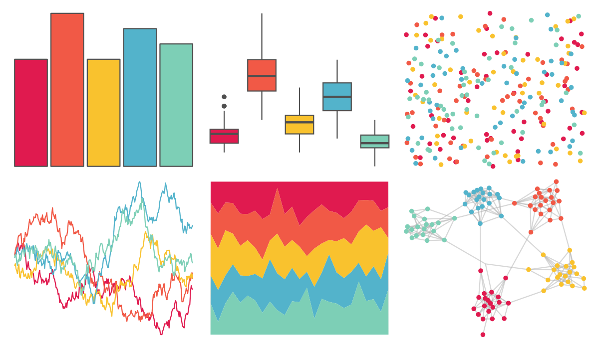

# PrettyCols - Lucent 

::: columns
::: {.column width="50%"}

**Github**

[nrennie/PrettyCols](https://github.com/nrennie/PrettyCols)
:::

::: {.column width="50%"}

**CRAN**

[PrettyCols](https://CRAN.R-project.org/package=PrettyCols)
:::
:::

<hr> 

Use with [paletteer](https://emilhvitfeldt.github.io/paletteer/) package:

```r
library(paletteer)
paletteer_d("PrettyCols::Lucent")
```

Use raw:

```r
c("#E01A4FFF", "#F15946FF", "#F9C22EFF", "#53B3CBFF", "#7DCFB6FF")
``` 

 

<br>

# Related Palettes

<div class="list" style="display: grid; grid-template-columns: auto auto auto;"> <figure class="figure">
<a href="../../amerika/Dem_Ind_Rep3/"> </a>
</figure> <figure class="figure">
<a href="../../wesanderson/Zissou1/"> </a>
</figure> <figure class="figure">
<a href="../../waRhol/marilyn_green_62/"> </a>
</figure> <figure class="figure">
<a href="../../fishualize/Bodianus_pulchellus/"> </a>
</figure> <figure class="figure">
<a href="../../MoMAColors/ustwo/"> </a>
</figure> <figure class="figure">
<a href="../../MoMAColors/Lupi/"> </a>
</figure> <figure class="figure">
<a href="../../NineteenEightyR/miami2/"> </a>
</figure> <figure class="figure">
<a href="../../waRhol/marilyn_orange_62/"> </a>
</figure> <figure class="figure">
<a href="../../lisa/M_C_Escher/"> </a>
</figure> <figure class="figure">
<a href="../../ggthemes/Jewel_Bright/"> </a>
</figure> <figure class="figure">
<a href="../../lisa/JackBush_1/"> </a>
</figure> <figure class="figure">
<a href="../../waRhol/the_big_c_86/"> </a>
</figure> 
</div>
