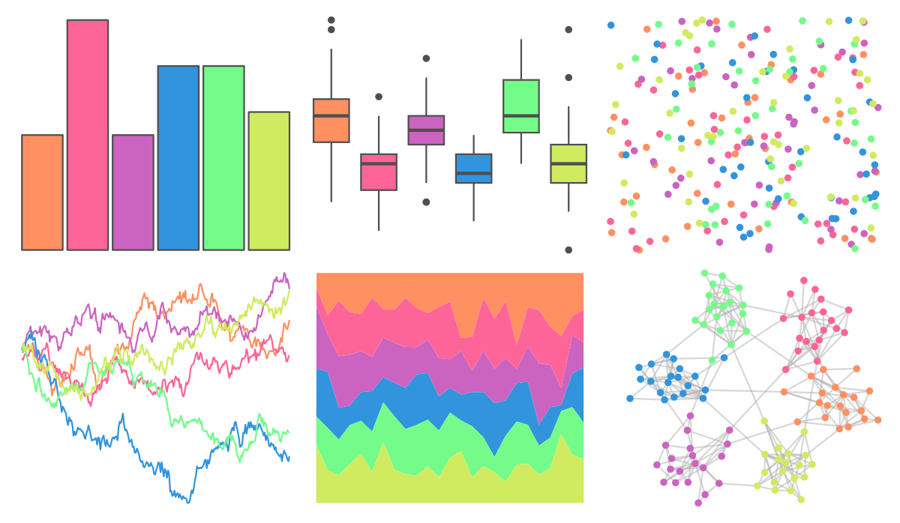

# PrettyCols - Neon 

::: columns
::: {.column width="50%"}

**Github**

[nrennie/PrettyCols](https://github.com/nrennie/PrettyCols)
:::

::: {.column width="50%"}

**CRAN**

[PrettyCols](https://CRAN.R-project.org/package=PrettyCols)
:::
:::

<hr> 

Use with [paletteer](https://emilhvitfeldt.github.io/paletteer/) package:

```r
library(paletteer)
paletteer_d("PrettyCols::Neon")
```

Use raw:

```r
c("#FF9062FF", "#FD6598FF", "#CB64C0FF", "#3294DDFF", "#75FB8AFF", "#D0EB60FF")
``` 

 

<br>

# Related Palettes

<div class="list" style="display: grid; grid-template-columns: auto auto auto;"> <figure class="figure">
<a href="../../amerika/Dem_Ind_Rep3/"> </a>
</figure> <figure class="figure">
<a href="../../fishualize/Callanthias_australis/"> </a>
</figure> <figure class="figure">
<a href="../../lisa/BillyApple/"> </a>
</figure> <figure class="figure">
<a href="../../ggthemes/excel_Parallax/"> </a>
</figure> <figure class="figure">
<a href="../../ggthemes/excel_Atlas/"> </a>
</figure> <figure class="figure">
<a href="../../RSkittleBrewer/tropical/"> </a>
</figure> <figure class="figure">
<a href="../../ggthemes/excel_Droplet/"> </a>
</figure> <figure class="figure">
<a href="../../ggthemes/excel_Berlin/"> </a>
</figure> <figure class="figure">
<a href="../../basetheme/brutal/"> </a>
</figure> <figure class="figure">
<a href="../../basetheme/dark/"> </a>
</figure> <figure class="figure">
<a href="../../ggsci/categorical8_atlassian/"> </a>
</figure> <figure class="figure">
<a href="../../vapoRwave/vapoRwave/"> </a>
</figure> 
</div>
