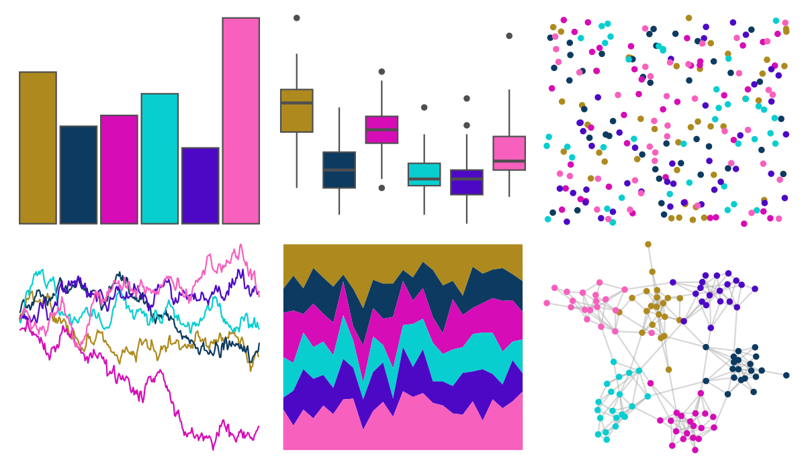

# PrettyCols - Oasis 

::: columns
::: {.column width="50%"}

**Github**

[nrennie/PrettyCols](https://github.com/nrennie/PrettyCols)
:::

::: {.column width="50%"}

**CRAN**

[PrettyCols](https://CRAN.R-project.org/package=PrettyCols)
:::
:::

<hr> 

Use with [paletteer](https://emilhvitfeldt.github.io/paletteer/) package:

```r
library(paletteer)
paletteer_d("PrettyCols::Oasis")
```

Use raw:

```r
c("#AE8A1EFF", "#0C3A61FF", "#D60CB6FF", "#09CED0FF", "#4D08C5FF", "#F760BDFF")
``` 

 

<br>

# Related Palettes

<div class="list" style="display: grid; grid-template-columns: auto auto auto;"> <figure class="figure">
<a href="../../amerika/Dem_Ind_Rep3/"> </a>
</figure> <figure class="figure">
<a href="../../beyonce/X18/"> </a>
</figure> <figure class="figure">
<a href="../../PrettyCols/Celestial/"> </a>
</figure> <figure class="figure">
<a href="../../trekcolors/lcars_2379/"> </a>
</figure> <figure class="figure">
<a href="../../LaCroixColoR/Berry/"> </a>
</figure> <figure class="figure">
<a href="../../ggthemr/solarized/"> </a>
</figure> <figure class="figure">
<a href="../../tvthemes/Alexandrite/"> </a>
</figure> <figure class="figure">
<a href="../../LaCroixColoR/Pamplemousse/"> </a>
</figure> <figure class="figure">
<a href="../../pals/tol/"> </a>
</figure> <figure class="figure">
<a href="../../vapoRwave/macPlus/"> </a>
</figure> <figure class="figure">
<a href="../../vapeplot/macplus/"> </a>
</figure> <figure class="figure">
<a href="../../LaCroixColoR/CranRaspberry/"> </a>
</figure> 
</div>
