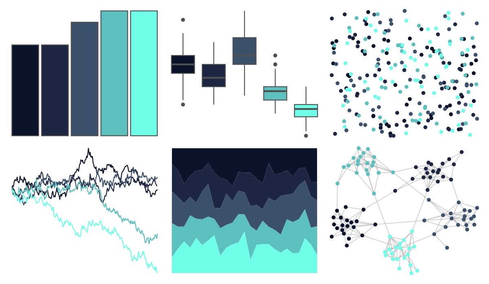

# PrettyCols - Ocean 

::: columns
::: {.column width="50%"}

**Github**

[nrennie/PrettyCols](https://github.com/nrennie/PrettyCols)
:::

::: {.column width="50%"}

**CRAN**

[PrettyCols](https://CRAN.R-project.org/package=PrettyCols)
:::
:::

<hr> 

Use with [paletteer](https://emilhvitfeldt.github.io/paletteer/) package:

```r
library(paletteer)
paletteer_d("PrettyCols::Ocean")
```

Use raw:

```r
c("#0B132BFF", "#1C2541FF", "#3A506BFF", "#5BC0BEFF", "#6FFFE9FF")
``` 

 

<br>

# Related Palettes

<div class="list" style="display: grid; grid-template-columns: auto auto auto;"> <figure class="figure">
<a href="../../amerika/Dem_Ind_Rep3/"> </a>
</figure> <figure class="figure">
<a href="../../NatParksPalettes/Denali/"> </a>
</figure> <figure class="figure">
<a href="../../futurevisions/europa/"> </a>
</figure> <figure class="figure">
<a href="../../fishualize/Thalassoma_bifasciatum/"> </a>
</figure> <figure class="figure">
<a href="../../fishualize/Ostracion_whitleyi/"> </a>
</figure> <figure class="figure">
<a href="../../ghibli/YesterdayMedium/"> </a>
</figure> <figure class="figure">
<a href="../../ButterflyColors/archaeoprepona_demophon_thalpius/"> </a>
</figure> <figure class="figure">
<a href="../../beyonce/X64/"> </a>
</figure> <figure class="figure">
<a href="../../MetBrewer/Pissaro/"> </a>
</figure> <figure class="figure">
<a href="../../lisa/GeorgiaOKeeffe/"> </a>
</figure> <figure class="figure">
<a href="../../rtist/okeeffe/"> </a>
</figure> <figure class="figure">
<a href="../../PrettyCols/Sea/"> </a>
</figure> 
</div>
