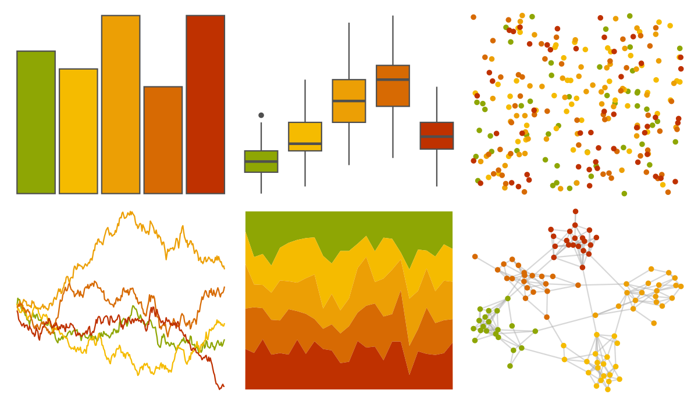

# PrettyCols - Peppers 

::: columns
::: {.column width="50%"}

**Github**

[nrennie/PrettyCols](https://github.com/nrennie/PrettyCols)
:::

::: {.column width="50%"}

**CRAN**

[PrettyCols](https://CRAN.R-project.org/package=PrettyCols)
:::
:::

<hr> 

Use with [paletteer](https://emilhvitfeldt.github.io/paletteer/) package:

```r
library(paletteer)
paletteer_d("PrettyCols::Peppers")
```

Use raw:

```r
c("#8EA604FF", "#F5BB00FF", "#EC9F05FF", "#D76A03FF", "#BF3100FF")
``` 

 

<br>

# Related Palettes

<div class="list" style="display: grid; grid-template-columns: auto auto auto;"> <figure class="figure">
<a href="../../amerika/Dem_Ind_Rep3/"> </a>
</figure> <figure class="figure">
<a href="../../fishualize/Hippocampus_reidi/"> </a>
</figure> <figure class="figure">
<a href="../../calecopal/eschscholzia/"> </a>
</figure> <figure class="figure">
<a href="../../fishualize/Labrisomus_nuchipinnis/"> </a>
</figure> <figure class="figure">
<a href="../../ggprism/flames/"> </a>
</figure> <figure class="figure">
<a href="../../fishualize/Chormis_multilineata/"> </a>
</figure> <figure class="figure">
<a href="../../ggprism/flames2/"> </a>
</figure> <figure class="figure">
<a href="../../fishualize/Dermatolepis_inermis/"> </a>
</figure> <figure class="figure">
<a href="../../NineteenEightyR/seventies_aint_done_yet/"> </a>
</figure> <figure class="figure">
<a href="../../MetBrewer/Homer2/"> </a>
</figure> <figure class="figure">
<a href="../../ggthemes/excel_Red_Orange/"> </a>
</figure> <figure class="figure">
<a href="../../beyonce/X59/"> </a>
</figure> 
</div>
