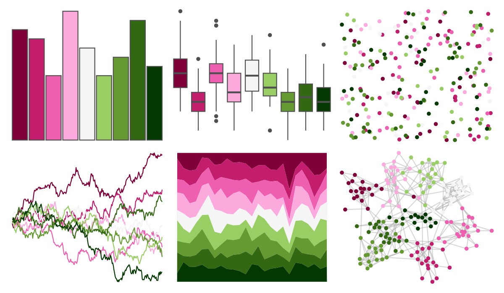

# PrettyCols - PinkGreens 

::: columns
::: {.column width="50%"}

**Github**

[nrennie/PrettyCols](https://github.com/nrennie/PrettyCols)
:::

::: {.column width="50%"}

**CRAN**

[PrettyCols](https://CRAN.R-project.org/package=PrettyCols)
:::
:::

<hr> 

Use with [paletteer](https://emilhvitfeldt.github.io/paletteer/) package:

```r
library(paletteer)
paletteer_d("PrettyCols::PinkGreens")
```

Use raw:

```r
c("#7F0038FF", "#C31E6EFF", "#EF5FAFFF", "#FCAADEFF", "#F5F5F5FF", "#99CE64FF", "#659A32FF", "#326812FF", "#033800FF")
``` 

 

<br>

# Related Palettes

<div class="list" style="display: grid; grid-template-columns: auto auto auto;"> <figure class="figure">
<a href="../../awtools/a_palette/"> </a>
</figure> <figure class="figure">
<a href="../../ButterflyColors/hamadryas_feronia/"> </a>
</figure> <figure class="figure">
<a href="../../ButterflyColors/hamadryas_feronia/"> </a>
</figure> <figure class="figure">
<a href="../../RColorBrewer/PiYG/"> </a>
</figure> <figure class="figure">
<a href="../../PrettyCols/PurpleGreens/"> </a>
</figure> <figure class="figure">
<a href="../../RColorBrewer/PRGn/"> </a>
</figure> <figure class="figure">
<a href="../../tvthemes/rickAndMorty/"> </a>
</figure> <figure class="figure">
<a href="../../palettetown/igglybuff/"> </a>
</figure> <figure class="figure">
<a href="../../LaCroixColoR/MurePepino/"> </a>
</figure> <figure class="figure">
<a href="../../MoMAColors/Kippenberger/"> </a>
</figure> <figure class="figure">
<a href="../../LaCroixColoR/PassionFruit/"> </a>
</figure> <figure class="figure">
<a href="../../feathers/princess_parrot/"> </a>
</figure> 
</div>
