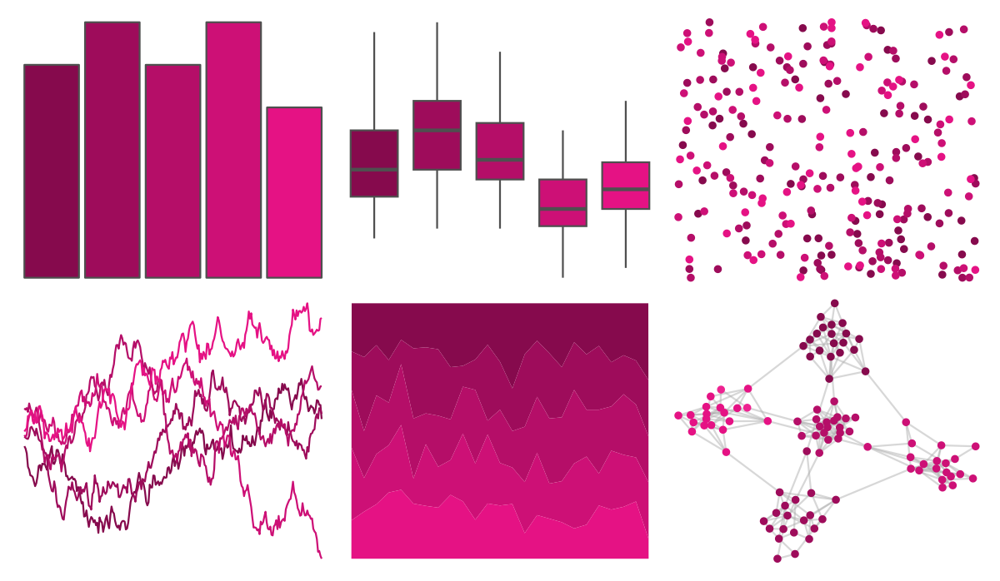

# PrettyCols - Pinks 

::: columns
::: {.column width="50%"}

**Github**

[nrennie/PrettyCols](https://github.com/nrennie/PrettyCols)
:::

::: {.column width="50%"}

**CRAN**

[PrettyCols](https://CRAN.R-project.org/package=PrettyCols)
:::
:::

<hr> 

Use with [paletteer](https://emilhvitfeldt.github.io/paletteer/) package:

```r
library(paletteer)
paletteer_d("PrettyCols::Pinks")
```

Use raw:

```r
c("#860A4DFF", "#9E0C5BFF", "#B50E68FF", "#CD1076FF", "#E51284FF", "#EE2290FF", "#F03A9CFF")
``` 

 

<br>

# Related Palettes

<div class="list" style="display: grid; grid-template-columns: auto auto auto;"> <figure class="figure">
<a href="../../awtools/a_palette/"> </a>
</figure> <figure class="figure">
<a href="../../ButterflyColors/hamadryas_feronia/"> </a>
</figure> <figure class="figure">
<a href="../../ButterflyColors/hamadryas_feronia/"> </a>
</figure> <figure class="figure">
<a href="../../NineteenEightyR/hotpink/"> </a>
</figure> <figure class="figure">
<a href="../../beyonce/X91/"> </a>
</figure> <figure class="figure">
<a href="../../vapeplot/sunset/"> </a>
</figure> <figure class="figure">
<a href="../../vapoRwave/sunSet/"> </a>
</figure> <figure class="figure">
<a href="../../ggprism/purple_passion/"> </a>
</figure> <figure class="figure">
<a href="../../ButterflyColors/chorinea_licursis/"> </a>
</figure> <figure class="figure">
<a href="../../unikn/pal_bordeaux/"> </a>
</figure> <figure class="figure">
<a href="../../PrettyCols/Purples/"> </a>
</figure> <figure class="figure">
<a href="../../MoMAColors/Flash/"> </a>
</figure> 
</div>
