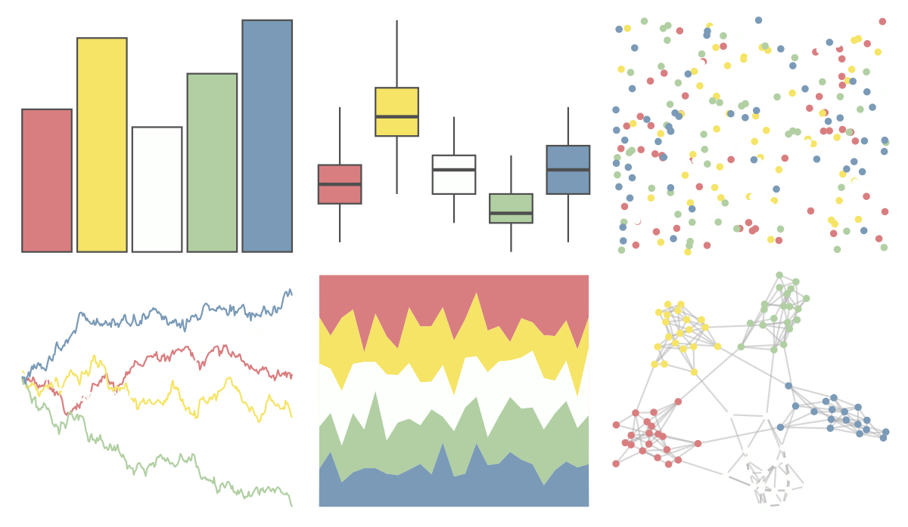

# PrettyCols - Prism 

::: columns
::: {.column width="50%"}

**Github**

[nrennie/PrettyCols](https://github.com/nrennie/PrettyCols)
:::

::: {.column width="50%"}

**CRAN**

[PrettyCols](https://CRAN.R-project.org/package=PrettyCols)
:::
:::

<hr> 

Use with [paletteer](https://emilhvitfeldt.github.io/paletteer/) package:

```r
library(paletteer)
paletteer_d("PrettyCols::Prism")
```

Use raw:

```r
c("#D97E80FF", "#F5E466FF", "#FDFFFCFF", "#B1CFA3FF", "#7A9AB7FF")
``` 

 

<br>

# Related Palettes

<div class="list" style="display: grid; grid-template-columns: auto auto auto;"> <figure class="figure">
<a href="../../amerika/Dem_Ind_Rep3/"> </a>
</figure> <figure class="figure">
<a href="../../ltc/olga/"> </a>
</figure> <figure class="figure">
<a href="../../PNWColors/Sailboat/"> </a>
</figure> <figure class="figure">
<a href="../../ltc/fernande/"> </a>
</figure> <figure class="figure">
<a href="../../lisa/RobertDelaunay_1/"> </a>
</figure> <figure class="figure">
<a href="../../nationalparkcolors/Zion/"> </a>
</figure> <figure class="figure">
<a href="../../lisa/JackBush_1/"> </a>
</figure> <figure class="figure">
<a href="../../NineteenEightyR/sonny/"> </a>
</figure> <figure class="figure">
<a href="../../rcartocolor/ArmyRose/"> </a>
</figure> <figure class="figure">
<a href="../../ltc/paloma/"> </a>
</figure> <figure class="figure">
<a href="../../ggthemes/few_Light/"> </a>
</figure> <figure class="figure">
<a href="../../wesanderson/Chevalier1/"> </a>
</figure> 
</div>
