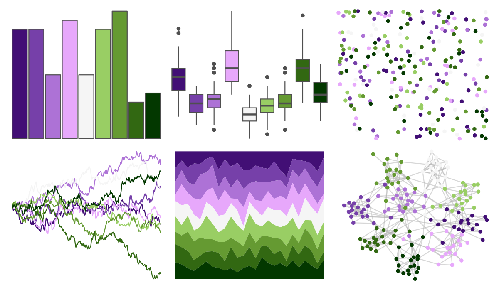
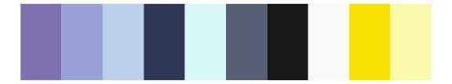

# PrettyCols - PurpleGreens 

::: columns
::: {.column width="50%"}

**Github**

[nrennie/PrettyCols](https://github.com/nrennie/PrettyCols)
:::

::: {.column width="50%"}

**CRAN**

[PrettyCols](https://CRAN.R-project.org/package=PrettyCols)
:::
:::

<hr> 

Use with [paletteer](https://emilhvitfeldt.github.io/paletteer/) package:

```r
library(paletteer)
paletteer_d("PrettyCols::PurpleGreens")
```

Use raw:

```r
c("#420F75FF", "#7640A9FF", "#AD72D6FF", "#E7A8FBFF", "#F5F5F5FF", "#99CE64FF", "#659A32FF", "#326812FF", "#033800FF")
``` 

 

<br>

# Related Palettes

<div class="list" style="display: grid; grid-template-columns: auto auto auto;"> <figure class="figure">
<a href="../../amerika/Dem_Ind_Rep3/"> </a>
</figure> <figure class="figure">
<a href="../../RColorBrewer/PRGn/"> </a>
</figure> <figure class="figure">
<a href="../../PrettyCols/PinkGreens/"> </a>
</figure> <figure class="figure">
<a href="../../trekcolors/dominion/"> </a>
</figure> <figure class="figure">
<a href="../../palettetown/regice/"> </a>
</figure> <figure class="figure">
<a href="../../RColorBrewer/PiYG/"> </a>
</figure> <figure class="figure">
<a href="../../palettetown/dratini/"> </a>
</figure> <figure class="figure">
<a href="../../LaCroixColoR/MurePepino/"> </a>
</figure> <figure class="figure">
<a href="../../ggthemr/lilac/"> </a>
</figure> <figure class="figure">
<a href="../../tvthemes/Diamonds/"> </a>
</figure> <figure class="figure">
<a href="../../tvthemes/Arryn/"> </a>
</figure> <figure class="figure">
<a href="../../tvthemes/Sapphire/"> </a>
</figure> 
</div>
