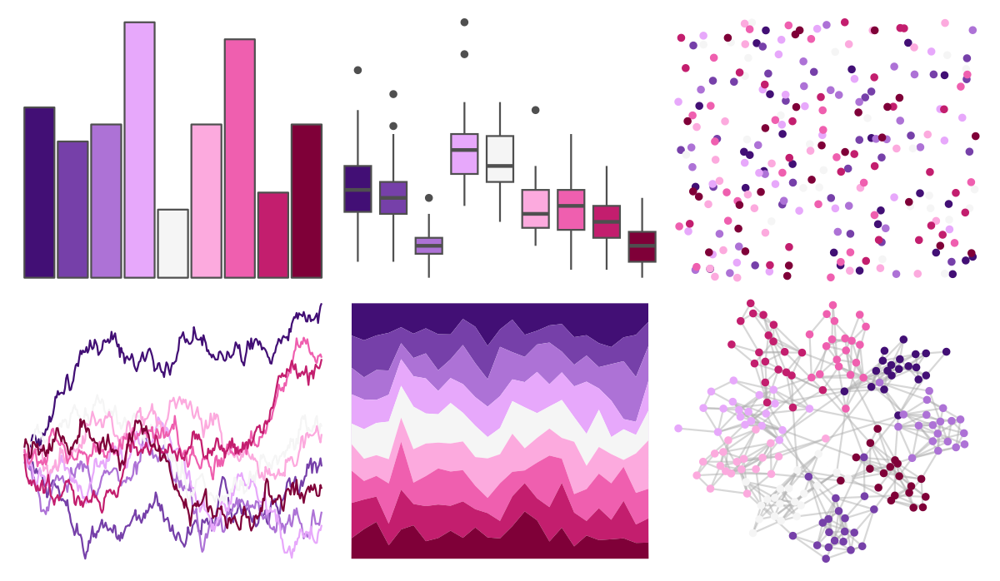
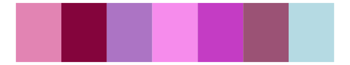

# PrettyCols - PurplePinks 

::: columns
::: {.column width="50%"}

**Github**

[nrennie/PrettyCols](https://github.com/nrennie/PrettyCols)
:::

::: {.column width="50%"}

**CRAN**

[PrettyCols](https://CRAN.R-project.org/package=PrettyCols)
:::
:::

<hr> 

Use with [paletteer](https://emilhvitfeldt.github.io/paletteer/) package:

```r
library(paletteer)
paletteer_d("PrettyCols::PurplePinks")
```

Use raw:

```r
c("#420F75FF", "#7640A9FF", "#AD72D6FF", "#E7A8FBFF", "#F5F5F5FF", "#FCAADEFF", "#EF5FAFFF", "#C31E6EFF", "#7F0038FF")
``` 

 

<br>

# Related Palettes

<div class="list" style="display: grid; grid-template-columns: auto auto auto;"> <figure class="figure">
<a href="../../awtools/a_palette/"> </a>
</figure> <figure class="figure">
<a href="../../ButterflyColors/hamadryas_feronia/"> </a>
</figure> <figure class="figure">
<a href="../../ButterflyColors/hamadryas_feronia/"> </a>
</figure> <figure class="figure">
<a href="../../Redmonder/qMSORdPu/"> </a>
</figure> <figure class="figure">
<a href="../../Redmonder/qMSOPu2/"> </a>
</figure> <figure class="figure">
<a href="../../tvthemes/RoseQuartz/"> </a>
</figure> <figure class="figure">
<a href="../../palettetown/zubat/"> </a>
</figure> <figure class="figure">
<a href="../../MetBrewer/Benedictus/"> </a>
</figure> <figure class="figure">
<a href="../../palettetown/forretress/"> </a>
</figure> <figure class="figure">
<a href="../../tvthemes/Spinel/"> </a>
</figure> <figure class="figure">
<a href="../../RColorBrewer/BuPu/"> </a>
</figure> <figure class="figure">
<a href="../../RColorBrewer/PuRd/"> </a>
</figure> 
</div>
