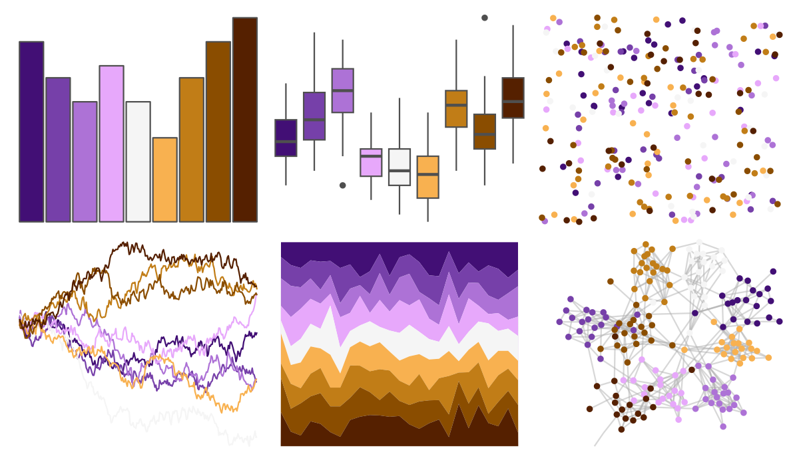

# PrettyCols - PurpleTangerines 

::: columns
::: {.column width="50%"}

**Github**

[nrennie/PrettyCols](https://github.com/nrennie/PrettyCols)
:::

::: {.column width="50%"}

**CRAN**

[PrettyCols](https://CRAN.R-project.org/package=PrettyCols)
:::
:::

<hr> 

Use with [paletteer](https://emilhvitfeldt.github.io/paletteer/) package:

```r
library(paletteer)
paletteer_d("PrettyCols::PurpleTangerines")
```

Use raw:

```r
c("#420F75FF", "#7640A9FF", "#AD72D6FF", "#E7A8FBFF", "#F5F5F5FF", "#F8B150FF", "#C17D17FF", "#8A4D00FF", "#552000FF")
``` 

 

<br>

# Related Palettes

<div class="list" style="display: grid; grid-template-columns: auto auto auto;"> <figure class="figure">
<a href="../../awtools/a_palette/"> </a>
</figure> <figure class="figure">
<a href="../../ButterflyColors/hamadryas_feronia/"> </a>
</figure> <figure class="figure">
<a href="../../ButterflyColors/hamadryas_feronia/"> </a>
</figure> <figure class="figure">
<a href="../../RColorBrewer/PuOr/"> </a>
</figure> <figure class="figure">
<a href="../../werpals/provence/"> </a>
</figure> <figure class="figure">
<a href="../../werpals/uyuni/"> </a>
</figure> <figure class="figure">
<a href="../../palettetown/nidoranm/"> </a>
</figure> <figure class="figure">
<a href="../../ggsci/default_flatui/"> </a>
</figure> <figure class="figure">
<a href="../../RColorBrewer/RdBu/"> </a>
</figure> <figure class="figure">
<a href="../../MetBrewer/Renoir/"> </a>
</figure> <figure class="figure">
<a href="../../palettetown/crobat/"> </a>
</figure> <figure class="figure">
<a href="../../nationalparkcolors/GeneralGrant/"> </a>
</figure> 
</div>
