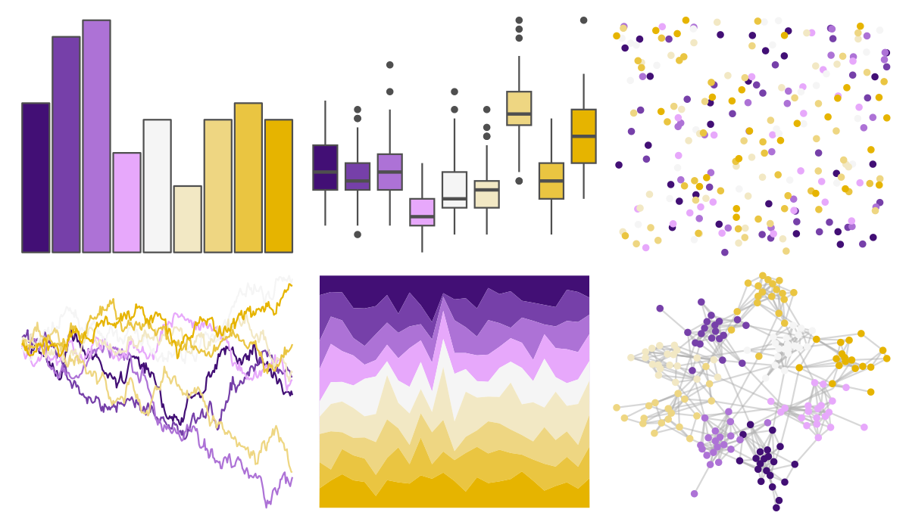

# PrettyCols - PurpleYellows 

::: columns
::: {.column width="50%"}

**Github**

[nrennie/PrettyCols](https://github.com/nrennie/PrettyCols)
:::

::: {.column width="50%"}

**CRAN**

[PrettyCols](https://CRAN.R-project.org/package=PrettyCols)
:::
:::

<hr> 

Use with [paletteer](https://emilhvitfeldt.github.io/paletteer/) package:

```r
library(paletteer)
paletteer_d("PrettyCols::PurpleYellows")
```

Use raw:

```r
c("#420F75FF", "#7640A9FF", "#AD72D6FF", "#E7A8FBFF", "#F5F5F5FF", "#F2E8C4FF", "#EED682FF", "#EAC541FF", "#E6B400FF")
``` 

 

<br>

# Related Palettes

<div class="list" style="display: grid; grid-template-columns: auto auto auto;"> <figure class="figure">
<a href="../../amerika/Dem_Ind_Rep3/"> </a>
</figure> <figure class="figure">
<a href="../../Redmonder/dPBIYlPu/"> </a>
</figure> <figure class="figure">
<a href="../../palettetown/heracross/"> </a>
</figure> <figure class="figure">
<a href="../../palettetown/nidoking/"> </a>
</figure> <figure class="figure">
<a href="../../beyonce/X66/"> </a>
</figure> <figure class="figure">
<a href="../../palettetown/dratini/"> </a>
</figure> <figure class="figure">
<a href="../../RColorBrewer/PiYG/"> </a>
</figure> <figure class="figure">
<a href="../../trekcolors/lcars_2357/"> </a>
</figure> <figure class="figure">
<a href="../../palettetown/qwilfish/"> </a>
</figure> <figure class="figure">
<a href="../../colRoz/n_violacea/"> </a>
</figure> <figure class="figure">
<a href="../../RColorBrewer/PRGn/"> </a>
</figure> <figure class="figure">
<a href="../../palettetown/chinchou/"> </a>
</figure> 
</div>
