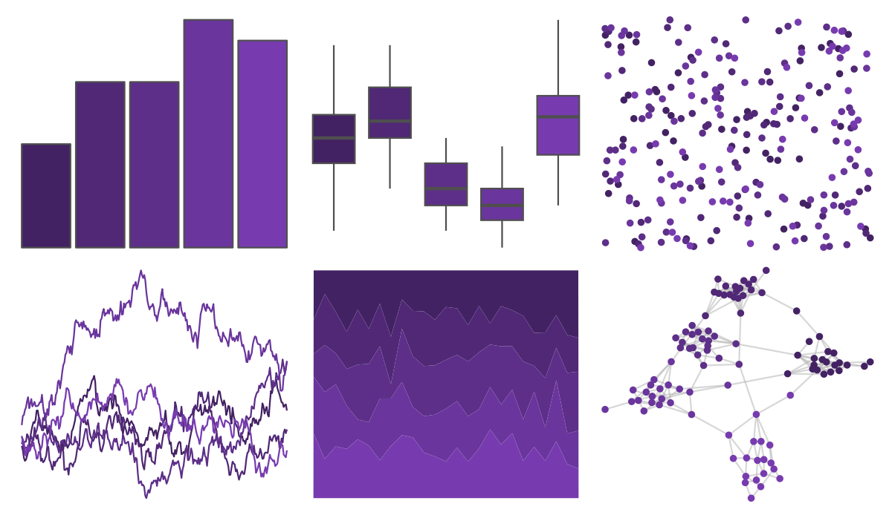

# PrettyCols - Purples 

::: columns
::: {.column width="50%"}

**Github**

[nrennie/PrettyCols](https://github.com/nrennie/PrettyCols)
:::

::: {.column width="50%"}

**CRAN**

[PrettyCols](https://CRAN.R-project.org/package=PrettyCols)
:::
:::

<hr> 

Use with [paletteer](https://emilhvitfeldt.github.io/paletteer/) package:

```r
library(paletteer)
paletteer_d("PrettyCols::Purples")
```

Use raw:

```r
c("#432263FF", "#502876FF", "#5D2F89FF", "#6A359CFF", "#773BAFFF", "#8444C0FF", "#9057C6FF")
``` 

 

<br>

# Related Palettes

<div class="list" style="display: grid; grid-template-columns: auto auto auto;"> <figure class="figure">
<a href="../../awtools/a_palette/"> </a>
</figure> <figure class="figure">
<a href="../../ButterflyColors/hamadryas_feronia/"> </a>
</figure> <figure class="figure">
<a href="../../ButterflyColors/hamadryas_feronia/"> </a>
</figure> <figure class="figure">
<a href="../../lisa/Prince/"> </a>
</figure> <figure class="figure">
<a href="../../ggthemes/excel_Violet_II/"> </a>
</figure> <figure class="figure">
<a href="../../miscpalettes/berry/"> </a>
</figure> <figure class="figure">
<a href="../../nord/polarnight/"> </a>
</figure> <figure class="figure">
<a href="../../beyonce/X98/"> </a>
</figure> <figure class="figure">
<a href="../../beyonce/X112/"> </a>
</figure> <figure class="figure">
<a href="../../beyonce/X31/"> </a>
</figure> <figure class="figure">
<a href="../../ghibli/SpiritedDark/"> </a>
</figure> <figure class="figure">
<a href="../../ggprism/purple_passion/"> </a>
</figure> 
</div>
