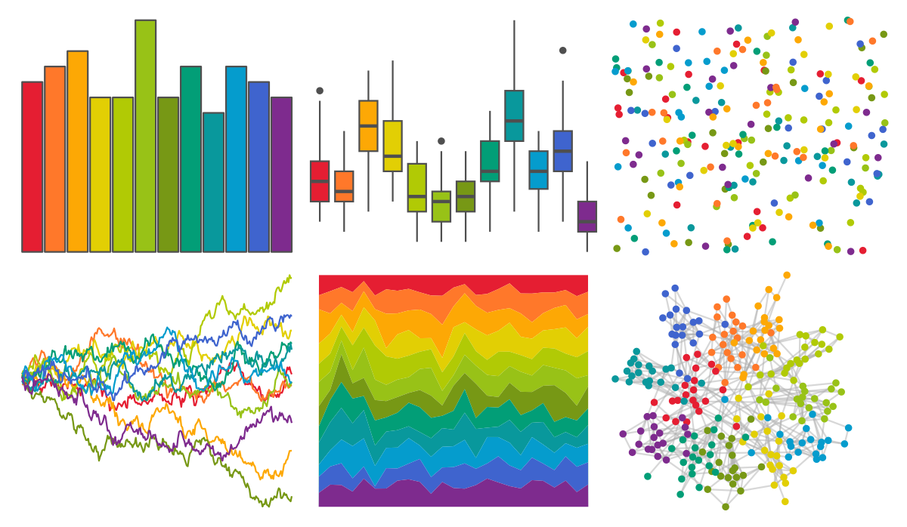

# PrettyCols - Rainbow 

::: columns
::: {.column width="50%"}

**Github**

[nrennie/PrettyCols](https://github.com/nrennie/PrettyCols)
:::

::: {.column width="50%"}

**CRAN**

[PrettyCols](https://CRAN.R-project.org/package=PrettyCols)
:::
:::

<hr> 

Use with [paletteer](https://emilhvitfeldt.github.io/paletteer/) package:

```r
library(paletteer)
paletteer_d("PrettyCols::Rainbow")
```

Use raw:

```r
c("#E51E32FF", "#FF782AFF", "#FDA805FF", "#E2CF04FF", "#B1CA05FF", "#98C217FF", "#779815FF", "#029E77FF", "#09989CFF", "#059CCDFF", "#3F64CEFF", "#7E2B8EFF")
``` 

 

<br>

# Related Palettes

<div class="list" style="display: grid; grid-template-columns: auto auto auto;"> <figure class="figure">
<a href="../../amerika/Dem_Ind_Rep3/"> </a>
</figure> <figure class="figure">
<a href="../../basetheme/deepblue/"> </a>
</figure> <figure class="figure">
<a href="../../ggthemes/Classic_Cyclic/"> </a>
</figure> <figure class="figure">
<a href="../../palettetown/oddish/"> </a>
</figure> <figure class="figure">
<a href="../../yarrr/basel/"> </a>
</figure> <figure class="figure">
<a href="../../RColorBrewer/Spectral/"> </a>
</figure> <figure class="figure">
<a href="../../jcolors/pal7/"> </a>
</figure> <figure class="figure">
<a href="../../Redmonder/qMSOStd/"> </a>
</figure> <figure class="figure">
<a href="../../tidyquant/tq_dark/"> </a>
</figure> <figure class="figure">
<a href="../../ggthemr/flat/"> </a>
</figure> <figure class="figure">
<a href="../../nbapalettes/bucks_city2/"> </a>
</figure> <figure class="figure">
<a href="../../LaCroixColoR/Mango/"> </a>
</figure> 
</div>
