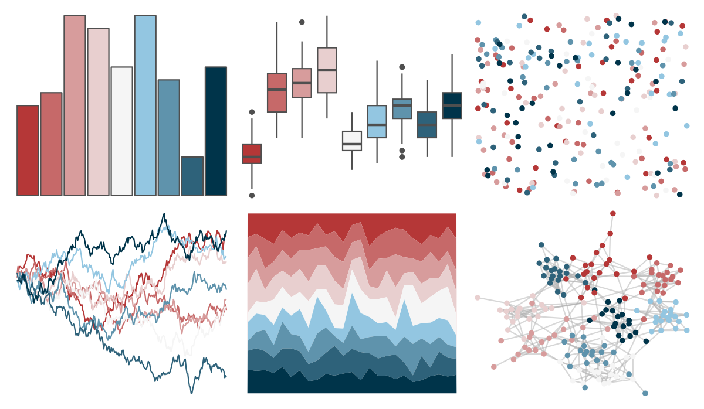

# PrettyCols - RedBlues 

::: columns
::: {.column width="50%"}

**Github**

[nrennie/PrettyCols](https://github.com/nrennie/PrettyCols)
:::

::: {.column width="50%"}

**CRAN**

[PrettyCols](https://CRAN.R-project.org/package=PrettyCols)
:::
:::

<hr> 

Use with [paletteer](https://emilhvitfeldt.github.io/paletteer/) package:

```r
library(paletteer)
paletteer_d("PrettyCols::RedBlues")
```

Use raw:

```r
c("#B53737FF", "#C66969FF", "#D79C9CFF", "#E8CFCFFF", "#F5F5F5FF", "#93C6E1FF", "#5F93ACFF", "#2E627AFF", "#00344AFF")
``` 

 

<br>

# Related Palettes

<div class="list" style="display: grid; grid-template-columns: auto auto auto;"> <figure class="figure">
<a href="../../amerika/Dem_Ind_Rep3/"> </a>
</figure> <figure class="figure">
<a href="../../palettetown/tangela/"> </a>
</figure> <figure class="figure">
<a href="../../palettetown/rhyhorn/"> </a>
</figure> <figure class="figure">
<a href="../../palettetown/phanpy/"> </a>
</figure> <figure class="figure">
<a href="../../palettetown/togetic/"> </a>
</figure> <figure class="figure">
<a href="../../RColorBrewer/RdBu/"> </a>
</figure> <figure class="figure">
<a href="../../palettetown/pupitar/"> </a>
</figure> <figure class="figure">
<a href="../../palettetown/nidoranf/"> </a>
</figure> <figure class="figure">
<a href="../../palettetown/nidoranm/"> </a>
</figure> <figure class="figure">
<a href="../../palettetown/nidorina/"> </a>
</figure> <figure class="figure">
<a href="../../palettetown/marill/"> </a>
</figure> <figure class="figure">
<a href="../../palettetown/beldum/"> </a>
</figure> 
</div>
