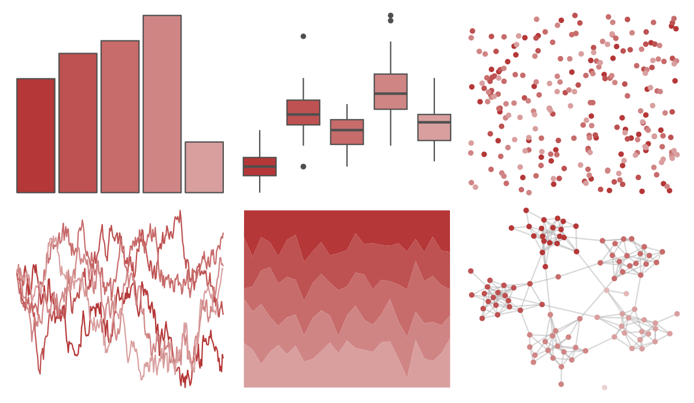

# PrettyCols - Reds 

::: columns
::: {.column width="50%"}

**Github**

[nrennie/PrettyCols](https://github.com/nrennie/PrettyCols)
:::

::: {.column width="50%"}

**CRAN**

[PrettyCols](https://CRAN.R-project.org/package=PrettyCols)
:::
:::

<hr> 

Use with [paletteer](https://emilhvitfeldt.github.io/paletteer/) package:

```r
library(paletteer)
paletteer_d("PrettyCols::Reds")
```

Use raw:

```r
c("#B53737FF", "#BE5151FF", "#C76B6BFF", "#D08585FF", "#D99F9FFF", "#E3B9B9FF", "#ECD3D3FF")
``` 

 

<br>

# Related Palettes

<div class="list" style="display: grid; grid-template-columns: auto auto auto;"> <figure class="figure">
<a href="../../awtools/a_palette/"> </a>
</figure> <figure class="figure">
<a href="../../ButterflyColors/hamadryas_feronia/"> </a>
</figure> <figure class="figure">
<a href="../../ButterflyColors/hamadryas_feronia/"> </a>
</figure> <figure class="figure">
<a href="../../Redmonder/sPBIRd/"> </a>
</figure> <figure class="figure">
<a href="../../rcartocolor/RedOr/"> </a>
</figure> <figure class="figure">
<a href="../../ltc/franscoise/"> </a>
</figure> <figure class="figure">
<a href="../../MetBrewer/Cassatt1/"> </a>
</figure> <figure class="figure">
<a href="../../fishualize/Epinephelus_striatus/"> </a>
</figure> <figure class="figure">
<a href="../../MetBrewer/Morgenstern/"> </a>
</figure> <figure class="figure">
<a href="../../calecopal/calochortus/"> </a>
</figure> <figure class="figure">
<a href="../../soilpalettes/crait/"> </a>
</figure> <figure class="figure">
<a href="../../beyonce/X44/"> </a>
</figure> 
</div>
