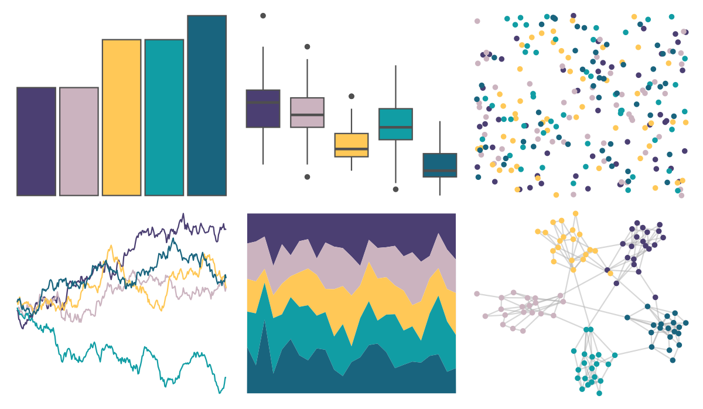

# PrettyCols - Relax 

::: columns
::: {.column width="50%"}

**Github**

[nrennie/PrettyCols](https://github.com/nrennie/PrettyCols)
:::

::: {.column width="50%"}

**CRAN**

[PrettyCols](https://CRAN.R-project.org/package=PrettyCols)
:::
:::

<hr> 

Use with [paletteer](https://emilhvitfeldt.github.io/paletteer/) package:

```r
library(paletteer)
paletteer_d("PrettyCols::Relax")
```

Use raw:

```r
c("#4B3F72FF", "#CBB3BFFF", "#FFC857FF", "#119DA4FF", "#19647EFF")
``` 

 

<br>

# Related Palettes

<div class="list" style="display: grid; grid-template-columns: auto auto auto;"> <figure class="figure">
<a href="../../awtools/a_palette/"> </a>
</figure> <figure class="figure">
<a href="../../ButterflyColors/hamadryas_feronia/"> </a>
</figure> <figure class="figure">
<a href="../../ButterflyColors/hamadryas_feronia/"> </a>
</figure> <figure class="figure">
<a href="../../nationalparkcolors/Acadia/"> </a>
</figure> <figure class="figure">
<a href="../../nbapalettes/grizzlies_00s/"> </a>
</figure> <figure class="figure">
<a href="../../nbapalettes/pacers_foundation/"> </a>
</figure> <figure class="figure">
<a href="../../ltc/minou/"> </a>
</figure> <figure class="figure">
<a href="../../ghibli/MarnieMedium1/"> </a>
</figure> <figure class="figure">
<a href="../../fishualize/Acanthurus_olivaceus/"> </a>
</figure> <figure class="figure">
<a href="../../MoMAColors/Ohchi/"> </a>
</figure> <figure class="figure">
<a href="../../lisa/MarcChagall/"> </a>
</figure> <figure class="figure">
<a href="../../nbapalettes/grizzlies_europe/"> </a>
</figure> 
</div>
