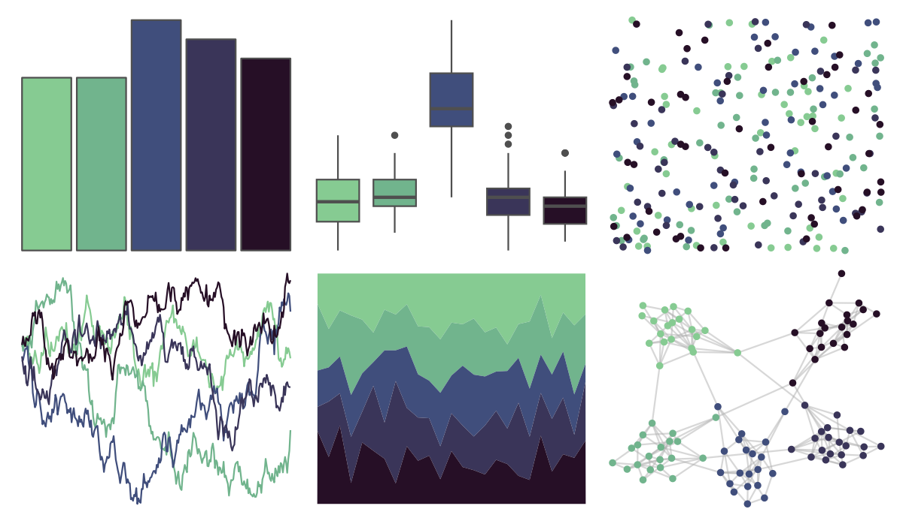

# PrettyCols - Sea 

::: columns
::: {.column width="50%"}

**Github**

[nrennie/PrettyCols](https://github.com/nrennie/PrettyCols)
:::

::: {.column width="50%"}

**CRAN**

[PrettyCols](https://CRAN.R-project.org/package=PrettyCols)
:::
:::

<hr> 

Use with [paletteer](https://emilhvitfeldt.github.io/paletteer/) package:

```r
library(paletteer)
paletteer_d("PrettyCols::Sea")
```

Use raw:

```r
c("#86CB92FF", "#71B48DFF", "#404E7CFF", "#3A3559FF", "#260F26FF")
``` 

 

<br>

# Related Palettes

<div class="list" style="display: grid; grid-template-columns: auto auto auto;"> <figure class="figure">
<a href="../../amerika/Dem_Ind_Rep3/"> </a>
</figure> <figure class="figure">
<a href="../../ButterflyColors/heliconius_sara_apseudes/"> </a>
</figure> <figure class="figure">
<a href="../../lisa/GeorgiaOKeeffe/"> </a>
</figure> <figure class="figure">
<a href="../../rtist/okeeffe/"> </a>
</figure> <figure class="figure">
<a href="../../beyonce/X21/"> </a>
</figure> <figure class="figure">
<a href="../../ghibli/YesterdayMedium/"> </a>
</figure> <figure class="figure">
<a href="../../MetBrewer/Pissaro/"> </a>
</figure> <figure class="figure">
<a href="../../MetBrewer/VanGogh1/"> </a>
</figure> <figure class="figure">
<a href="../../MoMAColors/Ernst/"> </a>
</figure> <figure class="figure">
<a href="../../vapoRwave/seaPunk/"> </a>
</figure> <figure class="figure">
<a href="../../vapeplot/seapunk/"> </a>
</figure> <figure class="figure">
<a href="../../MetBrewer/Cassatt2/"> </a>
</figure> 
</div>
