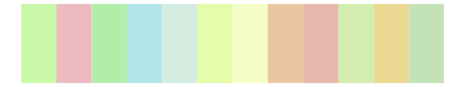
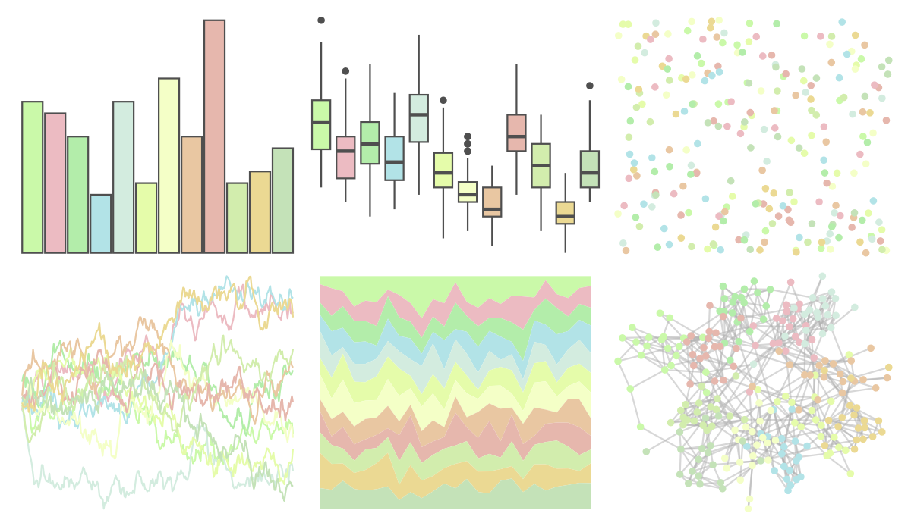

# PrettyCols - Spring 

::: columns
::: {.column width="50%"}

**Github**

[nrennie/PrettyCols](https://github.com/nrennie/PrettyCols)
:::

::: {.column width="50%"}

**CRAN**

[PrettyCols](https://CRAN.R-project.org/package=PrettyCols)
:::
:::

<hr> 

Use with [paletteer](https://emilhvitfeldt.github.io/paletteer/) package:

```r
library(paletteer)
paletteer_d("PrettyCols::Spring")
```

Use raw:

```r
c("#CAF9A9FF", "#ECBBC2FF", "#B3EDAAFF", "#B2E3E7FF", "#D3ECDFFF", "#E5FCAAFF", "#F4FFC7FF", "#E9C7A2FF", "#E6B7ADFF", "#D2EDADFF", "#EBD993FF", "#C4E2B8FF")
``` 

 

<br>

# Related Palettes

<div class="list" style="display: grid; grid-template-columns: auto auto auto;"> <figure class="figure">
<a href="../../amerika/Dem_Ind_Rep3/"> </a>
</figure> <figure class="figure">
<a href="../../RColorBrewer/Pastel2/"> </a>
</figure> <figure class="figure">
<a href="../../RColorBrewer/Pastel1/"> </a>
</figure> <figure class="figure">
<a href="../../miscpalettes/light/"> </a>
</figure> <figure class="figure">
<a href="../../khroma/pale/"> </a>
</figure> <figure class="figure">
<a href="../../yarrr/ipod/"> </a>
</figure> <figure class="figure">
<a href="../../wesanderson/Moonrise3/"> </a>
</figure> <figure class="figure">
<a href="../../ggthemes/Classic_10_Light/"> </a>
</figure> <figure class="figure">
<a href="../../ggthemes/excel_Madison/"> </a>
</figure> <figure class="figure">
<a href="../../tvthemes/MegaPearl/"> </a>
</figure> <figure class="figure">
<a href="../../RColorBrewer/Set3/"> </a>
</figure> <figure class="figure">
<a href="../../ltc/paloma/"> </a>
</figure> 
</div>
