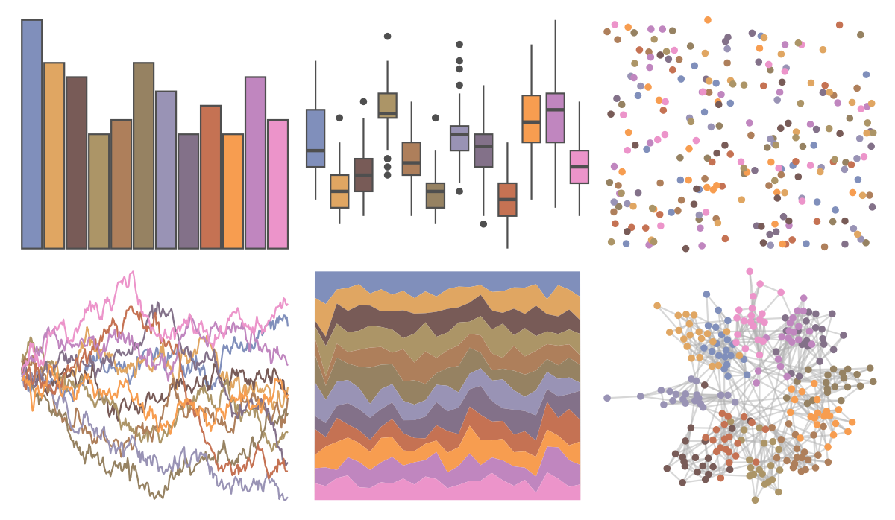

# PrettyCols - Summer 

::: columns
::: {.column width="50%"}

**Github**

[nrennie/PrettyCols](https://github.com/nrennie/PrettyCols)
:::

::: {.column width="50%"}

**CRAN**

[PrettyCols](https://CRAN.R-project.org/package=PrettyCols)
:::
:::

<hr> 

Use with [paletteer](https://emilhvitfeldt.github.io/paletteer/) package:

```r
library(paletteer)
paletteer_d("PrettyCols::Summer")
```

Use raw:

```r
c("#398DB2FF", "#D8B31EFF", "#2C350BFF", "#829625FF", "#867112FF", "#5D761EFF", "#6293A7FF", "#3E5A5EFF", "#AC5C05FF", "#FFA300FF", "#A47DB9FF", "#EC94CAFF")
``` 

 

<br>

# Related Palettes

<div class="list" style="display: grid; grid-template-columns: auto auto auto;"> <figure class="figure">
<a href="../../awtools/a_palette/"> </a>
</figure> <figure class="figure">
<a href="../../ButterflyColors/hamadryas_feronia/"> </a>
</figure> <figure class="figure">
<a href="../../ButterflyColors/hamadryas_feronia/"> </a>
</figure> <figure class="figure">
<a href="../../feathers/rose_crowned_fruit_dove/"> </a>
</figure> <figure class="figure">
<a href="../../ggthemes/stata_s2color/"> </a>
</figure> <figure class="figure">
<a href="../../MetBrewer/VanGogh2/"> </a>
</figure> <figure class="figure">
<a href="../../werpals/jozi/"> </a>
</figure> <figure class="figure">
<a href="../../yarrr/info2/"> </a>
</figure> <figure class="figure">
<a href="../../dutchmasters/milkmaid/"> </a>
</figure> <figure class="figure">
<a href="../../MetBrewer/Redon/"> </a>
</figure> <figure class="figure">
<a href="../../ltc/crbhits/"> </a>
</figure> <figure class="figure">
<a href="../../MoMAColors/Rattner/"> </a>
</figure> 
</div>
